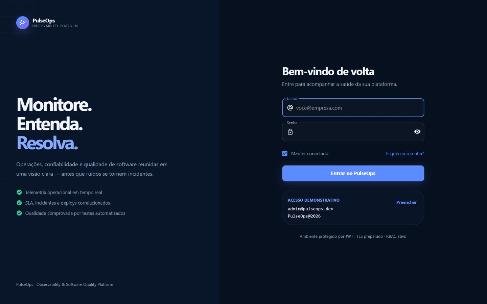
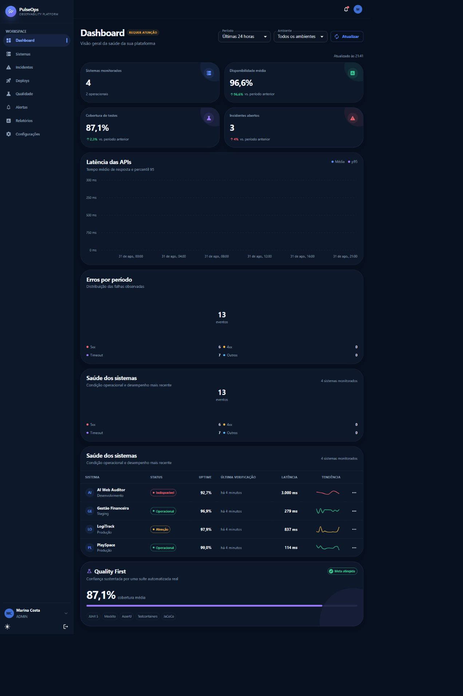
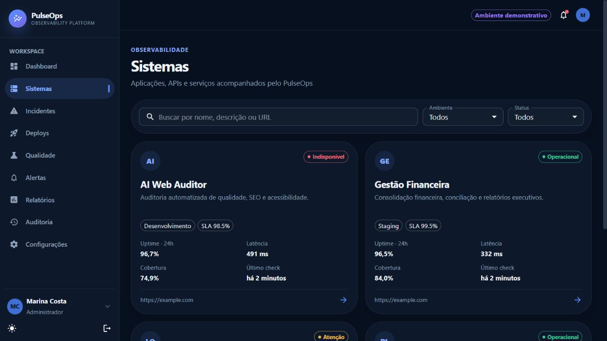
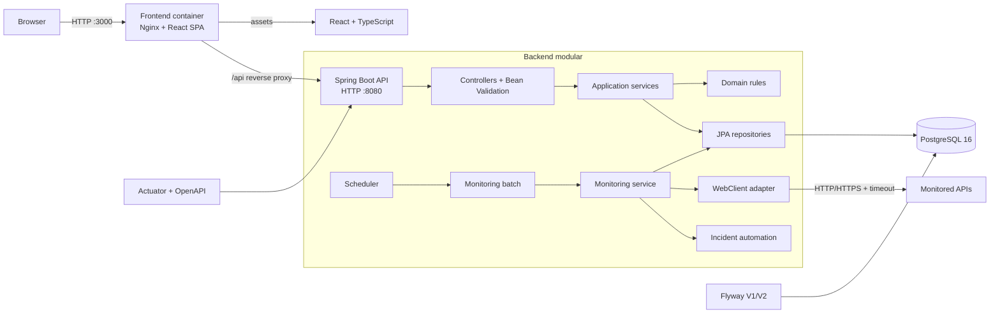
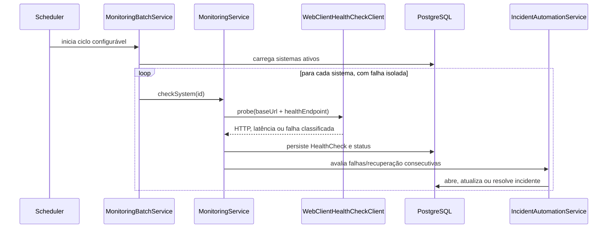

# PulseOps — Observability & Software Quality Platform

<div align="center">

**Monitore. Entenda. Resolva.**

Uma plataforma full stack de observabilidade que conecta saúde operacional, incidentes, deploys, SLA e qualidade de software em uma experiência SaaS coesa.


</div>

---

O PulseOps foi construído como um produto backend-first: regras operacionais explícitas, segurança nas fronteiras, persistência governada por migrations e uma suíte de testes que valida comportamento — não apenas linhas executadas. O frontend premium transforma esses dados em dashboards, timelines e fluxos utilizáveis em desktop, tablet e mobile.

## Sumário

- [Demonstração visual](#demonstração-visual)
- [Quality First](#quality-first)
- [Funcionalidades](#funcionalidades)
- [Arquitetura](#arquitetura)
- [Stack](#stack)
- [Qualidade e testes](#qualidade-e-testes)
- [Como executar](#como-executar)
- [API e documentação](#api-e-documentação)
- [Segurança](#segurança)
- [Docker, CI/CD e AWS](#docker-cicd-e-aws)
- [Estrutura do repositório](#estrutura-do-repositório)
- [Roadmap](#roadmap)

## Demonstração visual

### Login



### Dashboard operacional



### Catálogo de sistemas



### Hub de integrações

A área **Integrações** (`/integracoes`, com alias `/integrations`) reúne seis aplicações do ecossistema, destaca o AI Web Auditor e apresenta disponibilidade calculada, saúde, relatórios recebidos, mapa, filtros e testes de conexão pelo backend. Reutiliza os cadastros e históricos existentes, com indicação explícita de ausência de dados e do modo demonstrativo.

Consulte [configuração, contratos e segurança](docs/integrations.md) e o [relatório de validação desta entrega](docs/integrations-delivery.md).

## Quality First

> [!IMPORTANT]
> Qualidade é uma capacidade do produto e também uma propriedade do código. O PulseOps mede testes e cobertura dos sistemas monitorados enquanto seu próprio backend é protegido por uma suíte extensa de JUnit 5, Mockito, AssertJ, MockMvc e Testcontainers.

Resultados reais da validação completa de **11/09/2026**, com Docker Desktop ativo:

| Indicador | Resultado verificado |
| --- | ---: |
| Testes do backend | **315 executados, 315 aprovados** |
| Falhos / erros / ignorados | **0 / 0 / 0** |
| Integração com PostgreSQL 16.14 | **10/10 aprovados** |
| Cobertura de linhas | **90,26%** — 2.114 de 2.342 |
| Cobertura de branches | **77,15%** — 790 de 1.024 |
| Cobertura da camada de services | **94,44%** |
| Gate JaCoCo | **aprovado** — mínimo global de 85% em linhas |

Os números acima são derivados de `mvn clean verify` após a entrega da área de Integrações. Os detalhes estão no [relatório da feature](docs/integrations-delivery.md). O relatório navegável é gerado em `backend/target/site/jacoco/index.html`.

## Funcionalidades

### Observabilidade operacional

- cadastro e gestão de aplicações em `PRODUCTION`, `STAGING` e `DEVELOPMENT`;
- scheduler configurável que verifica automaticamente apenas sistemas ativos;
- health checks externos via `WebClient`, com timeout individual e isolamento de falhas;
- classificação em `OPERATIONAL`, `DEGRADED`, `DOWN` e `UNKNOWN`;
- histórico de status HTTP, latência, sucesso e causa da falha;
- disponibilidade por 24 horas, 7 dias e 30 dias;
- latência média, mínima, máxima e p95;
- SLA com meta por sistema, diferença, cumprimento e estado;
- dashboard agregado para evitar múltiplas requisições desnecessárias do frontend.

### Incidentes e deploys

- abertura automática de incidente após falhas consecutivas;
- proteção contra incidentes automáticos duplicados;
- promoção de severidade e resolução após recuperação consistente;
- fluxo manual `OPEN -> INVESTIGATING -> RESOLVED`;
- deploys com versão semântica, commit, ambiente, duração e descrição;
- transições `PENDING -> RUNNING -> SUCCESS | FAILED` e rollback controlado;
- timelines e filtros por sistema, severidade, status e data.

### Qualidade de software

- snapshots de testes totais, aprovados, falhos e ignorados;
- cobertura de linhas e branches por sistema;
- taxa de aprovação calculada a partir dos dados persistidos;
- classificações `EXCELLENT`, `GOOD`, `WARNING` e `CRITICAL`;
- visão consolidada, histórico de cobertura e indicadores por camada no frontend;
- relatório operacional exportável em CSV.

### Experiência SaaS

- dashboard responsivo com KPIs, comparação temporal, gráficos e sparklines;
- páginas completas de sistemas, incidentes, deploys, qualidade, alertas, relatórios, auditoria e configurações;
- login com credenciais demonstrativas, sessão JWT e logout;
- tema escuro premium, tema claro, drawer mobile e navegação por teclado;
- skeleton loaders, empty states, snackbars, drawers e diálogos acessíveis;
- formulários tipados com React Hook Form e Zod;
- error boundary global e mensagens amigáveis para falhas da API.

## Arquitetura



O frontend consome uma API REST stateless. No ambiente Docker, o mesmo Nginx que entrega a SPA encaminha `/api/*` para o backend; isso mantém uma única origem no navegador e elimina dependência de CORS no fluxo padrão. O fallback `try_files` preserva as rotas do React após refresh.

### Decisões de projeto

- **Controllers finos:** protocolo HTTP, validação, DTOs e autorização; regras permanecem nos services.
- **Domínio explícito:** entidades e enums organizados por contexto, sem regras escondidas em controllers.
- **Porta para integração externa:** o monitoramento depende de `HealthCheckClient`; `WebClientHealthCheckClient` é apenas o adapter.
- **Persistência segura:** Flyway cria e evolui o schema; Hibernate usa `ddl-auto=validate`.
- **Tempo consistente:** timestamps auditáveis usam `OffsetDateTime` em UTC e um `Clock` injetável torna regras temporais testáveis.
- **Mapeamento legível:** DTOs imutáveis em records e conversões explícitas, sem dependência de Lombok ou geração automática de mappers.
- **Falha isolada:** um alvo fora do ar não interrompe o ciclo dos demais sistemas.
- **Consultas agregadas:** dashboard, qualidade e relatórios usam endpoints orientados à tela, reduzindo chatty APIs.

### Fluxo de monitoramento



## Stack

| Camada | Tecnologias |
| --- | --- |
| Backend | Java 21, Spring Boot 3.5.16, Spring Web MVC, Spring Data JPA, Bean Validation, WebClient, Scheduler, Actuator |
| Segurança | Spring Security, JWT com JJWT, BCrypt, RBAC, CORS externo, handlers REST |
| Banco | PostgreSQL 16, Flyway, HikariCP, Hibernate em modo `validate` |
| Frontend | React 19, TypeScript 5.9, Vite 7, Material UI 7, React Router 7 |
| Dados e formulários | Axios, React Hook Form, Zod 4, Recharts 3 |
| Testes backend | JUnit 5, Mockito, AssertJ, MockMvc, Spring Boot Test, Security Test, Testcontainers, JaCoCo |
| Testes frontend | Vitest, Testing Library, jest-dom, user-event, ESLint, TypeScript build |
| Infraestrutura | Docker, Docker Compose, Nginx, imagens multi-stage, health checks, GitHub Actions |
| Deploy | workflow pós-CI via SSH para AWS EC2, Compose e preparação para TLS em reverse proxy externo |

## Qualidade e testes

### Estratégia

| Nível | Objetivo | Exemplos cobertos |
| --- | --- | --- |
| Unitário | validar regras com feedback rápido | status operacional, uptime, p95, SLA, qualidade, incidentes, deploys, usuários e JWT |
| Colaboração | verificar efeitos e ausência de efeitos | Mockito com `@Mock`, `@InjectMocks`, `verify`, `never`, `times` e `ArgumentCaptor` |
| Controller | validar contrato e segurança HTTP | MockMvc para `200`, `201`, `400`, `401`, `403`, `404`, JSON e Bean Validation |
| Integração | provar compatibilidade com a infraestrutura real | PostgreSQL 16.14, Flyway, repositories, queries, auditing, constraints e persistência |
| Frontend | proteger utilitários, sessão e estados de UI | Vitest e Testing Library, além de lint e build TypeScript |

Os mocks são usados nas fronteiras — repositories, client HTTP e serviços colaboradores. Entidades e DTOs simples são objetos reais. Os testes incluem sucesso, limites, transições inválidas, conflitos, falhas externas, autorização e entradas malformadas.

### Executar o backend

Windows PowerShell:

```powershell
cd backend
.\mvnw.cmd clean test
.\mvnw.cmd clean verify
```

Linux/macOS:

```bash
cd backend
./mvnw clean test
./mvnw clean verify
```

`clean verify` executa a suíte, gera os relatórios e aplica o gate JaCoCo de 85% em linhas. Docker precisa estar ativo para que os oito cenários Testcontainers sejam executados; a classe usa `disabledWithoutDocker = true` para permitir desenvolvimento sem o daemon.

Artefatos:

- Surefire: `backend/target/surefire-reports/`
- JaCoCo HTML: `backend/target/site/jacoco/index.html`
- JaCoCo XML: `backend/target/site/jacoco/jacoco.xml`

### Executar o frontend

```powershell
cd frontend
npm ci
npm run lint
npm run test:run
npm run build
```

O pipeline executa esses três gates (`lint`, testes e build de produção) antes de construir as imagens Docker.

## Como executar

### Opção recomendada: stack completa com um comando

Pré-requisito: Docker Desktop com Docker Compose v2.

```powershell
cd "C:\Users\LENOVO\Documents\ChatGPT\PulseOps"
docker compose up -d --build
```

O comando constrói e inicia PostgreSQL, backend e frontend. As dependências são ordenadas por health check: o backend aguarda o banco ficar saudável e o frontend aguarda o backend.

Confira o estado:

```powershell
docker compose ps
docker compose logs --tail=100 postgres backend frontend
```

Serviços:

| Recurso | URL / endereço |
| --- | --- |
| PulseOps | <http://localhost:3000> |
| API direta | <http://localhost:18083/api> |
| Swagger UI | <http://localhost:18083/swagger-ui.html> |
| OpenAPI JSON | <http://localhost:18083/api-docs> |
| Actuator health | <http://localhost:18083/actuator/health> |
| PostgreSQL local | `localhost:55432` |

Parar a aplicação sem apagar os dados:

```powershell
docker compose down
```

O volume nomeado `pulseops-postgres-data` persiste entre reinicializações. `docker compose down -v` também remove esse volume e, portanto, **apaga os dados locais**.

### Variáveis de ambiente

O Compose possui defaults próprios para demonstração local, então o primeiro start não exige um arquivo `.env`. Para personalizar portas, banco, JWT ou monitoramento:

```powershell
Copy-Item .env.example .env
```

Antes de qualquer ambiente compartilhado ou produção, substitua ao menos `POSTGRES_PASSWORD`, `JWT_SECRET` e `CORS_ALLOWED_ORIGINS`. O segredo JWT deve ter no mínimo 32 caracteres.

Variáveis principais:

| Variável | Default do Compose | Finalidade |
| --- | --- | --- |
| `FRONTEND_PORT` | `3000` | porta pública da SPA |
| `BACKEND_PORT` | `18083` | porta direta da API, ligada ao loopback |
| `POSTGRES_PORT` | `55432` | porta local do PostgreSQL, ligada ao loopback |
| `SPRING_PROFILES_ACTIVE` | `dev` | ativa seed somente no ambiente demonstrativo |
| `JWT_SECRET` | fallback local | chave de assinatura; deve ser trocada fora do ambiente local |
| `CORS_ALLOWED_ORIGINS` | localhost nas portas do frontend | origens permitidas para acesso direto à API |
| `MONITORING_INTERVAL_MS` | `60000` | intervalo entre ciclos do scheduler |
| `MONITORING_INITIAL_DELAY_MS` | `300000` | atraso inicial usado pelo Compose |
| `MONITORING_CONCURRENCY` | `4` | paralelismo máximo do batch |
| `MONITORING_ALLOW_PRIVATE_NETWORKS` | `false` | mantém bloqueio de destinos privados |

### Desenvolvimento sem rebuild do frontend

Suba apenas o PostgreSQL:

```powershell
docker compose up -d postgres
```

Backend em outro terminal, usando os defaults do Compose:

```powershell
cd backend
$env:DB_URL = "jdbc:postgresql://localhost:55432/pulseops"
$env:DB_USERNAME = "pulseops"
$env:DB_PASSWORD = "pulseops-local-change-before-production"
$env:JWT_SECRET = "dev-only-pulseops-signing-secret-change-before-production-2026"
.\mvnw.cmd spring-boot:run
```

Frontend com hot reload:

```powershell
cd frontend
npm ci
$env:VITE_API_URL = "http://localhost:8080/api"
npm run dev
```

Se um `.env` foi criado, use no terminal do backend as mesmas credenciais definidas nele.

## Credenciais demonstrativas

O seed existe apenas no perfil `dev`, só popula uma base sem sistemas e nunca é carregado no perfil `prod`.

| Role | E-mail | Senha | Uso sugerido |
| --- | --- | --- | --- |
| `ADMIN` | `admin@pulseops.dev` | `PulseOps@2026` | explorar todas as funcionalidades |
| `DEVELOPER` | `dev@pulseops.dev` | `PulseOps@2026` | incidentes, deploys, checks e métricas |
| `VIEWER` | `viewer@pulseops.dev` | `PulseOps@2026` | validar experiência somente leitura |

Também são criados dados coerentes para PlaySpace, LogiTrack, Gestão Financeira e AI Web Auditor: históricos de checks, incidentes, deploys, relatórios de qualidade e notificações.

> Os dados apresentados no ambiente público são dados demonstrativos gerados para simular cenários reais de operação.

No Compose, o modo público demonstrativo desativa o scheduler externo e bloqueia mutações na API, mantendo login, navegação, filtros, relatórios e métricas plenamente exploráveis sem permitir alterações persistentes por visitantes.

## API e documentação

### Autenticação

```bash
curl -X POST http://localhost:18083/api/auth/login \
  -H "Content-Type: application/json" \
  -d '{"email":"admin@pulseops.dev","password":"PulseOps@2026"}'
```

Rotas protegidas recebem:

```http
Authorization: Bearer <token>
```

### Endpoints principais

| Contexto | Endpoints |
| --- | --- |
| Auth | `POST /api/auth/login`, `POST /api/auth/register` |
| Dashboard | `GET /api/dashboard/summary`, `/latency`, `/errors`, `/health` |
| Sistemas | `GET/POST /api/systems`, `GET/PUT/DELETE /api/systems/{id}` |
| Checks e métricas | `POST /api/systems/{id}/checks`, `GET /api/systems/{id}/checks`, `/metrics` |
| Incidentes | `GET/POST /api/incidents`, `PATCH /api/incidents/{id}/investigating`, `/resolve` |
| Deploys | `GET/POST /api/deployments`, transições `/start`, `/success`, `/failure`, `/rollback` |
| Qualidade | `GET /api/quality/overview`, `/history`, `/systems/{id}/latest`, `POST /reports` |
| Alertas | `GET /api/notifications`, `PATCH /{id}/read`, `/read-all` |
| Relatórios | `GET /api/reports/operational` |
| Usuários | `GET/POST /api/users`, `GET/PUT/DELETE /api/users/{id}` |

Filtros de período aceitam `24h`, `7d` e `30d`; os endpoints aplicáveis também aceitam ambiente ou sistema. Consulte tipos, exemplos e schemas completos no Swagger UI.

### Contrato de erro

Validação, autenticação, autorização, conflito, recurso ausente e regra de negócio usam uma resposta JSON consistente:

```json
{
  "timestamp": "2026-08-31T12:00:00Z",
  "status": 404,
  "error": "Not Found",
  "message": "Monitored system não encontrado",
  "path": "/api/systems/00000000-0000-0000-0000-000000000000"
}
```

## Segurança

- API stateless com JWT assinado, expiração e issuer validados;
- senhas armazenadas com BCrypt, custo 12;
- RBAC com `ADMIN`, `DEVELOPER` e `VIEWER`, aplicado por endpoint e método;
- registro público limitado à role `VIEWER`;
- modo demonstrativo protegido também no backend: requisições mutáveis em `/api/**` retornam `403`, independentemente da interface;
- rate limiting no Nginx para tentativas de login no fluxo público;
- respostas REST padronizadas para `401` e `403`, sem redirecionamento HTML;
- CORS configurável por ambiente e proxy same-origin no fluxo Docker;
- consultas de notificação limitadas ao usuário presente no token;
- segredo JWT e credenciais de banco externos ao código em produção;
- containers de aplicação sem privilégios, com filesystem read-only, `no-new-privileges` e capabilities removidas;
- PostgreSQL e backend publicados apenas em `127.0.0.1` pelos defaults do Compose;
- logs Docker com rotação para evitar crescimento ilimitado.

### Proteção do monitoramento outbound

URLs monitoradas atravessam uma política contra SSRF antes da persistência e novamente antes do I/O. Ela restringe os schemes a HTTP/HTTPS, impede credenciais embutidas e mudança de origem pelo endpoint, valida todas as respostas DNS e bloqueia loopback, redes privadas, link-local, endereços reservados e endpoints conhecidos de metadata de nuvem. O bloqueio também reduz o risco de DNS rebinding.

O opt-in para redes privadas existe somente para desenvolvimento controlado. O perfil `prod` mantém esse acesso desabilitado.

Leia também [SECURITY.md](SECURITY.md) para práticas de implantação e reporte responsável.

## Docker, CI/CD e AWS

### Imagens

- `backend/Dockerfile`: build multi-stage com Maven e runtime Eclipse Temurin JRE 21, executado por usuário não-root;
- `frontend/Dockerfile`: build reproduzível com Node 22 e runtime Nginx 1.27;
- `frontend/nginx.conf`: SPA fallback, proxy `/api`, cache de assets, gzip e headers de segurança;
- `docker-compose.yml`: PostgreSQL 16 Alpine, rede dedicada, volume persistente, health checks, restart policy e logs rotacionados.

### CI

`.github/workflows/ci.yml` define três gates:

```text
Backend:  checkout -> Java 21 -> Maven clean verify -> relatório JaCoCo
Frontend: checkout -> Node 22 -> npm ci -> lint -> Vitest -> build
Containers: backend + frontend aprovados -> Docker Compose build
```

Falhas de teste interrompem o pipeline; a construção de containers só começa depois da aprovação dos jobs de backend e frontend.

### CD para AWS EC2

`.github/workflows/deploy.yml` reage apenas a uma execução bem-sucedida do workflow CI causada por push em `main`. O job:

1. faz checkout do SHA exato que foi validado;
2. valida os parâmetros de implantação;
3. configura chave SSH e `known_hosts` fornecidos por secrets;
4. empacota a release sem `.git`, `.env`, builds ou dependências locais;
5. cria um arquivo de ambiente de produção com permissão restrita;
6. transfere a release para a EC2;
7. executa `docker compose up -d --build --remove-orphans` e mostra o estado dos containers.

Secrets esperados: `EC2_HOST`, `EC2_USER`, `EC2_DEPLOY_PATH`, `EC2_SSH_KEY`, `EC2_SSH_KNOWN_HOSTS`, `POSTGRES_DB`, `POSTGRES_USER`, `POSTGRES_PASSWORD` e `JWT_SECRET`. A origem pública permitida é configurada pela variável `CORS_ALLOWED_ORIGINS` do environment de produção.

### HTTPS

O perfil `prod` respeita `X-Forwarded-*` (`forward-headers-strategy=framework`) e o Nginx interno encaminha esses cabeçalhos. Em EC2, termine TLS em um Application Load Balancer, Cloudflare, Caddy, Traefik ou outro reverse proxy externo e encaminhe o tráfego para a porta do frontend. Certificados e chaves não são versionados nem embutidos nas imagens.

Topologia recomendada:

```text
Internet -> HTTPS :443 -> ALB/reverse proxy -> frontend :3000 -> /api -> backend :8080 -> PostgreSQL
```

Mantenha as portas diretas do backend e do banco fora do Security Group público; nos defaults locais (`18083` e `55432`) elas já estão vinculadas somente ao loopback do host.

## Estrutura do repositório

```text
PulseOps/
├── .github/workflows/
│   ├── ci.yml                 # testes, cobertura, lint, build e imagens
│   └── deploy.yml             # release pós-CI para AWS EC2
├── backend/
│   ├── src/main/java/com/pulseops/
│   │   ├── client/            # porta e adapter para health checks externos
│   │   ├── config/            # segurança, OpenAPI, clock, auditing e seed
│   │   ├── controller/        # contratos REST e autorização
│   │   ├── domain/            # entidades e enums por contexto
│   │   ├── dto/               # requests, responses, commands e métricas
│   │   ├── exception/         # erros de domínio e handler global
│   │   ├── repository/        # JPA e queries operacionais
│   │   ├── scheduler/         # disparo periódico
│   │   ├── security/          # JWT, RBAC e segurança outbound
│   │   └── service/           # casos de uso e regras de negócio
│   ├── src/main/resources/
│   │   └── db/migration/      # schema e índices Flyway
│   ├── src/test/              # unitários, controller e integração PostgreSQL
│   ├── Dockerfile
│   └── pom.xml
├── frontend/
│   ├── src/
│   │   ├── auth/              # sessão e proteção de rotas
│   │   ├── components/        # UI compartilhada e dashboard
│   │   ├── layout/            # shell responsivo
│   │   ├── pages/             # módulos do produto
│   │   ├── services/          # API Axios e storage
│   │   ├── theme/             # tokens e temas dark/light
│   │   └── types/             # contratos TypeScript da API
│   ├── Dockerfile
│   ├── nginx.conf
│   └── package.json
├── docs/screenshots/          # capturas usadas neste README
├── .env.example
├── docker-compose.yml
├── CONTRIBUTING.md
├── SECURITY.md
└── README.md
```

## Roadmap

Itens deliberadamente futuros, não apresentados como funcionalidades atuais:

- multi-tenancy com organizações, projetos e isolamento de dados;
- autenticação OIDC/OAuth2 e rotação de refresh tokens;
- ingestão de métricas OpenTelemetry e exportação Prometheus;
- alertas por e-mail, Slack, Teams e webhooks com políticas de escalonamento;
- agentes distribuídos para synthetic monitoring em múltiplas regiões;
- trilha de auditoria administrativa e retenção configurável;
- fila/event streaming para volumes maiores de checks;
- manifests Kubernetes, Helm e estratégia blue/green;
- testes end-to-end automatizados no pipeline.

## Contribuição

Consulte [CONTRIBUTING.md](CONTRIBUTING.md) para convenções, gates locais e fluxo sugerido de mudanças.

---

<div align="center">

**PulseOps** — observabilidade operacional e qualidade de software no mesmo produto.

</div>
