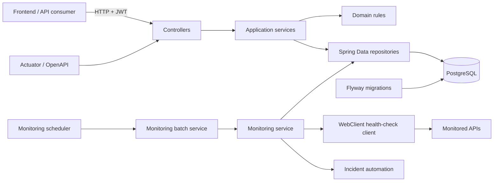

# PulseOps Backend

API da **PulseOps — Observability & Software Quality Platform**, responsável por autenticação, catálogo de sistemas, health checks, incidentes, deploys, métricas operacionais, SLA, notificações e indicadores de qualidade de software.

Este módulo foi construído com foco em regras de negócio explícitas, baixo acoplamento e testes automatizados. Controllers cuidam do protocolo HTTP; services concentram casos de uso e regras; repositories isolam persistência; e integrações externas ficam atrás de clients.

## Stack

- Java 21
- Spring Boot 3.5.16
- Maven Wrapper
- Spring Web MVC e Bean Validation
- Spring Data JPA e PostgreSQL
- Spring Security, JWT (JJWT) e BCrypt
- Flyway
- Spring WebFlux `WebClient` para health checks externos
- Spring Scheduler
- Spring Boot Actuator e Cache
- Springdoc OpenAPI / Swagger UI
- JUnit 5, Mockito, AssertJ e Spring Security Test
- MockMvc e Spring Boot Test
- Testcontainers com PostgreSQL 16
- JaCoCo

DTOs imutáveis usam Java records e os mapeamentos são explícitos. O projeto não depende de geração de schema pelo Hibernate, Lombok ou mapeadores automáticos.

## Arquitetura



Fluxo principal de monitoramento:

1. `MonitoringScheduler` dispara um ciclo no intervalo configurado.
2. `MonitoringBatchService` carrega apenas sistemas ativos e isola a falha de cada sistema.
3. `WebClientHealthCheckClient` consulta o endpoint remoto com timeout próprio.
4. `MonitoringStatusEvaluator` transforma a resposta em uma decisão operacional.
5. `MonitoringService` persiste o `HealthCheck`, atualiza o status do sistema e aciona a automação de incidentes.
6. Services de disponibilidade, latência e SLA agregam o histórico persistido para a API.

### Organização dos pacotes

```text
com.pulseops
├── client          # porta e adapter WebClient para serviços externos
├── config          # segurança, OpenAPI, clock, auditing e seed de desenvolvimento
├── controller      # contratos HTTP e autorização por endpoint
├── domain          # entidades e enums por contexto
├── dto             # requests, responses, commands e métricas
├── exception       # exceções de domínio e tratamento HTTP global
├── repository      # persistência e queries Spring Data
├── scheduler       # execução periódica do monitoramento
├── security        # JWT, principal, filtros e handlers REST
└── service         # casos de uso e regras de negócio
```

## Modelo de domínio

Todas as entidades usam UUID e timestamps auditáveis em UTC.

| Entidade | Responsabilidade | Dados e estados principais |
| --- | --- | --- |
| `User` | Identidade e autorização | nome, e-mail único, hash BCrypt e role `ADMIN`, `DEVELOPER` ou `VIEWER` |
| `MonitoredSystem` | Configuração de uma aplicação monitorada | URL base, health endpoint, ambiente, status, timeout, código HTTP esperado, limite de latência e meta de disponibilidade |
| `HealthCheck` | Resultado imutável de uma sondagem | instante, HTTP status opcional, tempo de resposta, sucesso e mensagem de erro |
| `Incident` | Evento operacional | severidade `LOW` a `CRITICAL`, status `OPEN`, `INVESTIGATING` ou `RESOLVED`, origem manual/automática e período |
| `Deployment` | Ciclo de uma entrega | versão semântica, ambiente, commit, duração e estado `PENDING`, `RUNNING`, `SUCCESS`, `FAILED` ou `ROLLED_BACK` |
| `TestReport` | Snapshot de qualidade | totais de testes, aprovados, falhos, ignorados, cobertura de linhas/branches e instante de geração |
| `Notification` | Alerta pertencente a um usuário | título, mensagem, tipo, leitura e criação |

O schema adiciona constraints para consistência de enums, percentuais, contagens, códigos HTTP, tempos e datas, além de índices voltados às consultas operacionais por sistema e período.

## Regras de negócio

### Status do monitoramento

- `OPERATIONAL`: status HTTP esperado, latência dentro do limite e janela recente estável.
- `DEGRADED`: resposta HTTP inesperada ainda não crítica, latência acima do limite ou quantidade configurável de falhas na janela recente.
- `DOWN`: timeout, falha de DNS, conexão recusada, erro de rede, resposta HTTP 5xx ou limite de falhas consecutivas atingido.
- `UNKNOWN`: estado inicial ou sem decisão operacional suficiente.

Uma resposta lenta pode ser classificada como `DEGRADED` sem ser registrada como indisponibilidade de transporte. O motivo da decisão é preservado no health check para diagnóstico.

### Incidentes automáticos

- Abrem após uma quantidade configurável de falhas consecutivas.
- Não duplicam um incidente automático enquanto já houver outro ativo para o sistema.
- Elevam a severidade de `HIGH` para `CRITICAL` ao alcançar o segundo limite configurável.
- São resolvidos apenas depois de uma sequência configurável de checks plenamente saudáveis: sucesso, HTTP esperado e latência dentro do limite.

### Disponibilidade, latência e SLA

- Disponibilidade: `checks com sucesso / total de checks * 100`, com três casas decimais.
- Períodos suportados pela API: `24h`, `7d` e `30d`.
- Sem amostras, a disponibilidade é `0.000` e o SLA retorna `NO_DATA`; isso evita comunicar uma disponibilidade artificial.
- Latência considera amostras que alcançaram o servidor e calcula quantidade, média, mínimo, máximo e p95 pelo método nearest-rank.
- SLA compara a disponibilidade atual com `targetAvailability` e retorna meta, diferença, cumprimento e status `MET`, `AT_RISK`, `BREACHED` ou `NO_DATA`.
- Um resultado até `0.100` ponto percentual abaixo da meta é classificado como `AT_RISK`; abaixo disso, `BREACHED`.

### Qualidade de software

A taxa de aprovação é calculada por:

```text
passedTests / totalTests * 100
```

O score de cobertura pondera 60% de cobertura de linhas e 40% de branches. A classificação segue regras reais:

| Classificação | Critérios mínimos |
| --- | --- |
| `EXCELLENT` | nenhum teste falho, aprovação >= 98%, linhas >= 90% e branches >= 85% |
| `GOOD` | falhas limitadas a 1% (mínimo tolerado de uma), aprovação >= 95%, linhas >= 80% e branches >= 70% |
| `WARNING` | aprovação >= 80%, linhas >= 60% e branches >= 50% |
| `CRITICAL` | qualquer resultado abaixo dos critérios anteriores ou relatório sem testes |

As contagens precisam ser não negativas e `passed + failed + skipped` deve ser igual ao total. Coberturas aceitam somente valores entre 0 e 100, e relatórios futuros são rejeitados.

### Deployments

- A versão deve seguir Semantic Versioning, com prefixo `v` opcional.
- Commit, quando informado, deve conter entre 7 e 64 caracteres hexadecimais.
- O fluxo normal é `PENDING -> RUNNING -> SUCCESS | FAILED`.
- Rollback é permitido somente a partir de `SUCCESS` ou `FAILED` e exige role `ADMIN`.
- Transições inválidas e durações negativas são rejeitadas como regras de negócio.

## Autenticação e RBAC

A API é stateless. O login devolve um JWT assinado, tipo `Bearer`, expiração e o usuário autenticado. Senhas são armazenadas com BCrypt, custo 12. O registro público sempre cria um usuário `VIEWER`; apenas um administrador pode criar usuários com outras roles pela API administrativa.

Rotas públicas:

- `POST /api/auth/login`
- `POST /api/auth/register`
- `GET /actuator/health`
- `/api-docs/**` e `/swagger-ui/**`

Para as demais rotas:

```http
Authorization: Bearer <token>
```

| Capacidade | ADMIN | DEVELOPER | VIEWER |
| --- | :---: | :---: | :---: |
| Ler dashboards, sistemas, métricas, incidentes, deploys e qualidade | Sim | Sim | Sim |
| Executar health check sob demanda | Sim | Sim | Não |
| Criar e atualizar incidentes | Sim | Sim | Não |
| Criar e transicionar deploys | Sim | Sim | Não |
| Registrar relatório de qualidade | Sim | Sim | Não |
| Fazer rollback | Sim | Não | Não |
| Criar, editar e excluir sistemas | Sim | Não | Não |
| Gerenciar usuários | Sim | Não | Não |

Notificações são sempre consultadas e alteradas no escopo do usuário contido no JWT.

## Endpoints

Os endpoints abaixo mostram os contratos principais. Filtros opcionais aparecem entre parênteses.

| Método | Endpoint | Uso |
| --- | --- | --- |
| `POST` | `/api/auth/login` | autenticar com e-mail e senha |
| `POST` | `/api/auth/register` | registrar um novo `VIEWER` |
| `GET` | `/api/dashboard/summary?period=24h&environment=PRODUCTION` | KPIs agregados do dashboard |
| `GET` | `/api/dashboard/latency?period=24h&environment=PRODUCTION` | série temporal de latência |
| `GET` | `/api/dashboard/errors?period=24h&environment=PRODUCTION` | breakdown de erros |
| `GET` | `/api/dashboard/health?period=24h&environment=PRODUCTION` | saúde consolidada por sistema |
| `GET` | `/api/systems` | listar sistemas |
| `GET` | `/api/systems/{id}` | detalhar sistema |
| `POST` | `/api/systems` | cadastrar sistema (`ADMIN`) |
| `PUT` | `/api/systems/{id}` | atualizar sistema (`ADMIN`) |
| `DELETE` | `/api/systems/{id}` | excluir sistema (`ADMIN`) |
| `POST` | `/api/systems/{id}/checks` | executar check sob demanda |
| `GET` | `/api/systems/{id}/metrics?period=7d` | disponibilidade, latência e SLA |
| `GET` | `/api/systems/{id}/checks?page=0&size=20` | histórico paginado de checks |
| `GET` | `/api/incidents?systemId=&status=&severity=` | pesquisar incidentes |
| `POST` | `/api/incidents` | abrir incidente |
| `PATCH` | `/api/incidents/{id}/investigating` | iniciar investigação |
| `PATCH` | `/api/incidents/{id}/resolve` | resolver incidente |
| `GET` | `/api/deployments?systemId=` | listar deploys |
| `POST` | `/api/deployments` | criar deploy pendente |
| `PATCH` | `/api/deployments/{id}/start` | iniciar deploy |
| `PATCH` | `/api/deployments/{id}/success` | finalizar com sucesso |
| `PATCH` | `/api/deployments/{id}/failure` | finalizar com falha |
| `PATCH` | `/api/deployments/{id}/rollback` | registrar rollback (`ADMIN`) |
| `GET` | `/api/quality/systems/{systemId}/latest` | obter o relatório mais recente |
| `POST` | `/api/quality/reports` | registrar e classificar relatório |
| `GET` | `/api/notifications?page=0&size=20` | listar notificações do usuário |
| `PATCH` | `/api/notifications/{id}/read` | marcar uma notificação como lida |
| `PATCH` | `/api/notifications/read-all` | marcar todas como lidas |
| `GET/POST` | `/api/users` | listar/criar usuários (`ADMIN`) |
| `GET/PUT/DELETE` | `/api/users/{id}` | consultar/alterar/excluir usuário (`ADMIN`) |

Swagger UI: `http://localhost:8080/swagger-ui.html`

Documento OpenAPI: `http://localhost:8080/api-docs`

Health: `http://localhost:8080/actuator/health`

## Erros da API

`GlobalExceptionHandler` e os handlers de segurança mantêm um contrato JSON consistente para validação, autenticação, autorização, conflitos, recursos inexistentes e erros inesperados.

```json
{
  "timestamp": "2026-08-27T12:00:00Z",
  "status": 404,
  "error": "Not Found",
  "message": "Monitored system não encontrado",
  "path": "/api/systems/00000000-0000-0000-0000-000000000000"
}
```

Quando houver erro de Bean Validation, `validationErrors` associa cada campo à primeira mensagem aplicável. Os principais status são `400`, `401`, `403`, `404`, `409`, `422` e `500`.

## Scheduler e WebClient

O scheduler usa fixed delay: um novo ciclo começa depois que o ciclo anterior termina. Isso evita sobreposição provocada por uma execução mais lenta. O atraso inicial e o intervalo são externos à aplicação.

O client:

- resolve `baseUrl` e `healthEndpoint` com `URI`;
- aplica o timeout individual configurado em cada `MonitoredSystem`;
- não propaga uma indisponibilidade externa como falha do processo;
- classifica timeout, DNS, conexão recusada, rede e erro inesperado;
- não consome o corpo completo apenas para descobrir o status HTTP.

O batch captura falhas por sistema, segue verificando os demais e gera um resumo do ciclo no log.

## Persistência e Flyway

O Hibernate usa `ddl-auto=validate`. Flyway é a única fonte de criação e evolução do schema:

- `V1__create_core_schema.sql`: tabelas, FKs, constraints e regras de integridade.
- `V2__add_operational_indexes.sql`: unicidade case-insensitive e índices de consulta operacional.

Na inicialização, Flyway aplica migrations pendentes e o Hibernate valida se o mapeamento corresponde ao banco. `flyway.clean` permanece desabilitado nos perfis `dev` e `prod`.

## Perfis e configuração

| Perfil | Finalidade |
| --- | --- |
| `dev` | padrão local; banco local, logs de desenvolvimento e seed demonstrativo |
| `prod` | exige conexão e segredo via ambiente, respeita headers do reverse proxy e não executa seed |
| `test` | usado pela suíte; integração sobrescreve a conexão com o container PostgreSQL |

Variáveis reconhecidas:

| Variável | Padrão local | Observação |
| --- | --- | --- |
| `SPRING_PROFILES_ACTIVE` | `dev` | use `prod` em produção |
| `SERVER_PORT` | `8080` | porta HTTP |
| `DB_URL` | `jdbc:postgresql://localhost:5432/pulseops` | obrigatória em `prod` |
| `DB_USERNAME` | `pulseops` | obrigatória em `prod` |
| `DB_PASSWORD` | `pulseops` | obrigatória em `prod` |
| `DB_POOL_MAX_SIZE` | `10` | máximo do HikariCP |
| `DB_POOL_MIN_IDLE` | `2` | mínimo ocioso do HikariCP |
| `JWT_SECRET` | somente fallback de desenvolvimento | obrigatório em `prod`; use segredo forte e aleatório |
| `JWT_EXPIRATION_SECONDS` | `3600` | vida do token |
| `JWT_ISSUER` | `pulseops` | emissor esperado |
| `CORS_ALLOWED_ORIGINS` | `http://localhost:*` | padrões separados conforme binding do Spring |
| `MONITORING_INTERVAL_MS` | `60000` | fixed delay entre ciclos |
| `MONITORING_INITIAL_DELAY_MS` | `15000` | espera antes do primeiro ciclo |
| `MONITORING_FAILURE_THRESHOLD` | `3` | falhas consecutivas para status `DOWN` |
| `MONITORING_RECENT_WINDOW_SIZE` | `5` | tamanho da janela de estabilidade |
| `MONITORING_DEGRADED_FAILURES` | `2` | falhas na janela para `DEGRADED` |
| `INCIDENT_FAILURE_THRESHOLD` | `3` | falhas para abrir incidente automático |
| `INCIDENT_RECOVERY_THRESHOLD` | `2` | sucessos plenos para resolver incidente automático |
| `INCIDENT_CRITICAL_THRESHOLD` | `5` | falhas para severidade crítica |

Nunca use o segredo JWT de desenvolvimento fora de uma máquina local.

## Executando localmente

Pré-requisitos:

- JDK 21
- Docker Desktop ou uma instância PostgreSQL compatível

Exemplo de PostgreSQL local isolado:

```powershell
docker run --name pulseops-postgres -e POSTGRES_DB=pulseops -e POSTGRES_USER=pulseops -e POSTGRES_PASSWORD=pulseops -p 5432:5432 -d postgres:16-alpine
```

Windows PowerShell:

```powershell
cd backend
$env:SPRING_PROFILES_ACTIVE = "dev"
.\mvnw.cmd spring-boot:run
```

Linux/macOS:

```bash
cd backend
SPRING_PROFILES_ACTIVE=dev ./mvnw spring-boot:run
```

Exemplo de autenticação:

```bash
curl -X POST http://localhost:8080/api/auth/login \
  -H "Content-Type: application/json" \
  -d '{"email":"admin@pulseops.dev","password":"PulseOps@2026"}'
```

## Seed demonstrativo

`DevelopmentDataSeeder` é protegido por `@Profile("dev")` e não é carregado em `prod`. Ele só popula uma base que ainda não possua sistemas monitorados.

Dados incluídos:

- sistemas: PlaySpace, LogiTrack, Gestão Financeira e AI Web Auditor;
- históricos de checks com sucessos, falhas e latências variadas;
- incidentes abertos, em investigação e resolvidos;
- deploys bem-sucedidos e com falha;
- evolução de relatórios de testes;
- notificações lidas e não lidas.

Credenciais exclusivamente demonstrativas:

| Role | E-mail | Senha |
| --- | --- | --- |
| `ADMIN` | `admin@pulseops.dev` | `PulseOps@2026` |
| `DEVELOPER` | `dev@pulseops.dev` | `PulseOps@2026` |
| `VIEWER` | `viewer@pulseops.dev` | `PulseOps@2026` |

## Qualidade e testes

Qualidade é uma parte estrutural deste backend, não apenas uma métrica de cobertura. A suíte espelha os pacotes de produção e combina testes rápidos de regras com poucos testes de integração de alto valor.

### Ferramentas

- **JUnit 5**: ciclo de vida, testes parametrizados e descrição de cenários.
- **Mockito**: isolamento de repositories, clients e colaborações entre services; uso de `@ExtendWith(MockitoExtension.class)`, `@Mock`, `@InjectMocks`, stubbing e verificação de interações.
- **AssertJ**: assertions legíveis sobre valores, coleções, exceções e objetos capturados.
- **MockMvc**: contratos HTTP, validação JSON, status e segurança sem subir um servidor real.
- **Spring Boot Test / Security Test**: slices web, contexto e usuários/autorização em testes de controller.
- **Testcontainers**: PostgreSQL 16 real para validar migrations, repositories, queries, auditing e constraints.
- **JaCoCo**: relatório HTML/XML e gate de cobertura de linhas.

### Estratégia

1. **Testes unitários de domínio e services** cobrem caminhos felizes, limites, entradas inválidas, conflitos, exceções e transições de estado.
2. **Mocks são usados apenas nas fronteiras**: repositories, client HTTP, autenticação e services colaboradores. DTOs e entidades simples permanecem reais.
3. **Testes de controller** validam `200`, `201`, `400`, `401`, `403`, `404`, payloads JSON e RBAC.
4. **Teste de integração PostgreSQL** sobe `postgres:16-alpine`, executa Flyway e verifica persistência, ordenação temporal, filtros, unicidade e constraints reais.
5. **JaCoCo** gera o relatório na fase `test` e exige cobertura global de linhas mínima de 85% na fase `verify`.

A classe de integração usa `@Testcontainers(disabledWithoutDocker = true)`. Sem Docker, ela é ignorada; portanto, uma validação completa da Fase 1 exige Docker ativo.

### Como executar

Windows:

```powershell
cd backend
.\mvnw.cmd clean test
.\mvnw.cmd clean verify
```

Linux/macOS:

```bash
cd backend
./mvnw clean test
./mvnw clean verify
```

Executar uma classe durante desenvolvimento:

```powershell
.\mvnw.cmd -Dtest=MonitoringServiceTest test
.\mvnw.cmd -Dtest=PostgreSqlRepositoryIntegrationTest test
```

- `clean test` compila e executa os testes, incluindo a integração quando Docker está disponível, e gera o relatório JaCoCo.
- `clean verify` repete a validação e também aplica o gate mínimo de 85% configurado no `pom.xml`.
- Relatórios Surefire: `target/surefire-reports/`.
- Relatório JaCoCo: abra `target/site/jacoco/index.html` no navegador.

### Resultados reais

Resultado da execução `mvn clean verify` de 10/09/2026, com Docker Desktop ativo:

| Indicador | Resultado |
| --- | ---: |
| Testes executados | **269** |
| Aprovados | **269** |
| Falhos / erros / ignorados | **0 / 0 / 0** |
| Integração PostgreSQL 16 | **8/8 aprovados** |
| Cobertura de linhas | **89,37%** (1.925 de 2.154) |
| Cobertura de branches | **74,13%** (662 de 893) |

Os números acima são evidência da execução versionada neste estado do projeto e devem ser atualizados sempre que a suíte mudar.

## Checklist da Fase 1

- [x] `clean verify` concluído com Docker ativo
- [x] Testcontainers executou contra PostgreSQL 16.14 real
- [x] Flyway aplicou V1/V2 e Hibernate validou o schema
- [x] JaCoCo passou pelo gate configurado
- [x] autenticação e matriz RBAC validadas
- [x] scheduler e tratamento de falhas externas validados
- [x] Swagger e Actuator acessíveis no ambiente local
