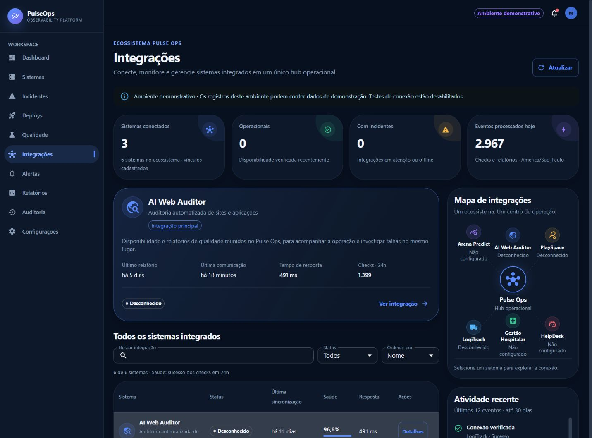
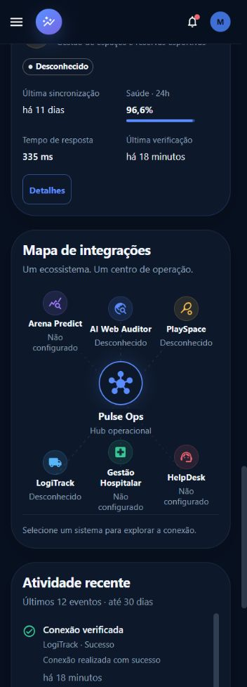

# Entrega — Integrações do Pulse Ops

Validação concluída em 11/09/2026. Área disponível em **http://localhost:3000/integracoes**, com alias `/integrations`.

## Resultado entregue

Hub integrado ao layout e à navegação existentes, com seis sistemas no catálogo, destaque para AI Web Auditor, quatro indicadores, tabela/cards, busca, filtro, ordenação, mapa SVG, atividade, modal de detalhes e teste de conexão pelo backend. Dados ausentes são apresentados explicitamente. O ambiente principal continua demonstrativo e protegido contra escrita.

## Arquitetura adotada

Frontend React/TypeScript/MUI: página orquestradora, componentes pequenos, cliente de API separado, contratos tipados e hook de consulta com cancelamento, atualização a cada 60 segundos somente na aba visível e retenção dos dados após falha parcial. Reutilizados `AppShell`, `PageHeader`, `Panel`, `KpiCard`, `ViewState`, `SystemStatusChip`, tokens, ícones, tema e formatação do projeto. Nenhuma biblioteca nova.

Backend Spring Boot: controller com autorização, DTOs, serviços de catálogo/projeção/atividade/verificação e repositories existentes. GETs não disparam tráfego externo. Consultas de atividade são limitadas; o resultado de rede usa o pipeline já existente de persistência e incidentes automáticos.

## Endpoints criados

| Endpoint | Finalidade |
| --- | --- |
| `GET /api/integrations` | Lista, resumo, modo de leitura e horário da consulta |
| `GET /api/integrations/events` | Atividade agregada |
| `GET /api/integrations/{id}` | Detalhes |
| `GET /api/integrations/{id}/events` | Atividade por integração |
| `POST /api/integrations/{id}/health-check` | Verificação normalizada, persistida e com cooldown |

Não foi necessário um endpoint separado de resumo ou um cadastro paralelo. O botão de nova integração foi omitido; o cadastro operacional continua na área Sistemas.

## Modelos/entidades criados ou reutilizados

Reutilizados `MonitoredSystem`, `HealthCheck`, `TestReport` e `OperationalEventResponse`. Criados catálogo de metadados e DTOs específicos, sem novas entidades/tabelas de integrações ou eventos. Migration V3 adiciona índice em `test_reports(monitored_system_id, created_at DESC)`.

## Como o status das integrações funciona

Check recente bem-sucedido e sem degradação resulta em Online. Latência elevada, respostas inesperadas e falhas recentes podem resultar em Atenção. Timeout, DNS, recusa e HTTP 5xx resultam em Offline. Sem evidência, com evidência futura/desatualizada ou monitoramento pausado, o estado é Desconhecido. Vínculos ausentes exibem Não configurado.

Validade padrão: cinco minutos. Cooldown: um minuto, com retorno `cached` e `nextCheckAt`. Saúde: taxa real de sucesso em 24h, exigindo cinco amostras. Eventos de hoje: checks + relatórios recebidos no dia local. Última sincronização: recebimento de relatório, não um ping de saúde. Todos os critérios e variáveis estão em [integrations.md](integrations.md).

## Como AI Web Auditor está conectado

O card principal associa o cadastro existente aos checks e relatórios já persistidos. O contrato existente `POST /api/quality/reports` foi preservado e validado com envio HTTP 201 no banco isolado. O recebimento apareceu na atividade e atualizou a sincronização. O teste de conexão não alterou essa data.

Não havia contrato de screenshots, artefatos ou webhook ativo no código inspecionado. Esses números não foram inventados. A instância externa efetiva do AI Web Auditor não foi verificada: nenhum endereço operacional real foi presumido. Os testes de rede desta entrega usaram destinos HTTP locais controlados, identificados como QA nas evidências.

## Estratégia de segurança

JWT e RBAC preservados: ADMIN/DEVELOPER/VIEWER consultam; ADMIN/DEVELOPER testam; o modo demonstrativo bloqueia escritas no servidor e na interface. Administração permanece no fluxo de Sistemas e suas permissões existentes.

O endpoint de teste aceita somente slug do catálogo e usa a configuração persistida. A validação de saída mantém bloqueio de redes privadas por padrão, metadata e mudança de origem. O cliente fixa os IPs aprovados para impedir uma segunda resolução DNS e não segue redirects. Timeout cobre DNS e HTTP. URLs internas, endpoints, credenciais e mensagens internas de exceção não são publicados nos DTOs da área. Links públicos são opcionais e sanitizados.

## Testes adicionados

Foram adicionados **46 casos ao backend** e **21 ao frontend**, mantendo todos os testes anteriores.

- Backend: vínculo/não configuração, resumo, métricas insuficientes, limites do dia, recebimento versus geração, normalização e expiração de status, atividade, autorização, demo, cache, referência JPA desconectada, DNS, recusa, timeout, HTTP 5xx, redirects e IP fixado. Testcontainers validou queries e migration em PostgreSQL 16.14.
- Frontend: renderização, loading, retry, falha parcial, empty state, pesquisa com acentos, status, ordenação, cards mobile, detalhes, sucesso/falha de teste, feedback acessível dentro do diálogo, restrições de perfil/demo/não configuração, cancelamento e atualização sem sobreposição.

## Resultado dos testes

| Validação | Resultado |
| --- | --- |
| Backend `mvn clean verify` — Java 21 em Docker | **315 aprovados; 0 falhas, 0 erros, 0 ignorados** |
| PostgreSQL/Testcontainers | **10 testes aprovados** |
| Cobertura global de linhas | **90,26% — 2.114/2.342**, anteriormente 89,37% |
| Cobertura de branches | **77,15% — 790/1.024**, anteriormente 74,13% |
| Cobertura de services | **94,44%**, anteriormente 93,48% |
| Gate JaCoCo de 85% em linhas | **Aprovado** |
| Frontend `npm run test:run` | **29 aprovados em 8 arquivos** |
| ESLint | **Sem erros ou warnings** |

`clean verify` executou as fases de teste e package, gerou o JAR e verificou a cobertura. Não houve exclusão de testes para obter aprovação. A execução Java utilizou filesystem Linux dentro do container para evitar o atraso de gravação do JaCoCo no bind mount do Windows.

Avisos revisados: notas já existentes de generics em testes, aviso CDS da instrumentação Mockito e conexões fechadas após encerramento do PostgreSQL de Testcontainers. Não houve erro de execução ou falha de gate. Logs preservados em `backend-verification.log`, `frontend/frontend-tests.log` e `frontend/lint.log`; relatório em `backend/target/site/jacoco/index.html`.

## Resultado do build

Backend: **BUILD SUCCESS**, JAR gerado em `backend/target/pulseops-backend-0.1.0-SNAPSHOT.jar`. Frontend: **TypeScript + Vite aprovados**, incluindo o último ajuste de acessibilidade e atividade. Log: `frontend/frontend-build.log`.

`npm audit --omit=dev`: **zero vulnerabilidades**. A auditoria completa apontou **duas moderadas na cadeia de ferramentas de desenvolvimento Vitest**, já presente; atualização de versão major deve ser tratada separadamente. Nenhuma dependência foi adicionada pela feature.

## Resultado do Docker

`docker compose config --quiet`, build de backend/frontend e `up -d` concluídos. Frontend, backend e PostgreSQL terminaram **healthy**; `/healthz` e `/actuator/health` responderam **UP**.

Uma tentativa de subida, durante compilação e testes simultâneos, excedeu a janela de readiness. O backend concluiu sua inicialização e a nova execução de `up -d` foi bem-sucedida. Na verificação final não havia exceções nos logs de execução do backend. A última reconstrução do frontend foi aplicada ao Compose.

O banco demonstrativo principal foi preservado. Verificações com escrita foram realizadas em banco/containers QA separados. Nenhuma alteração de política de rede privada foi aplicada ao ambiente principal.

## Testes realizados no navegador

Browser real Chromium do aplicativo, acessando a versão Docker e um frontend local com proxy para o backend QA:

- Login, sidebar ativa, rota canônica e redirecionamento `/integrations` → `/integracoes`.
- Resumo, destaque do auditor, lista, busca, filtro Offline, empty state, mapa e atividade.
- Modal de sistema não configurado sem ação inválida; dados sensíveis mascarados.
- Teste real de conexão bem-sucedida, falha por conexão recusada e resultado recente reutilizado. Feedback exibido dentro do diálogo e persistência refletida nas consultas.
- Loading observado; erro de consulta e retry; dados anteriores preservados após falha de atualização. Falha parcial também coberta por teste automatizado.
- Tema claro/escuro, navegação mobile, Tab com foco visível, Escape e retorno de foco ao botão que abriu o modal.
- Regressão de Dashboard, Sistemas, Incidentes, Deploys, Qualidade, Alertas, Relatórios, Auditoria e Configurações: páginas e dados carregaram sem telas de erro.
- Console final sem erros/warnings JS. Requisições finais observadas nos logs do proxy com HTTP 200; sem 404/500/CORS inesperados no fluxo final. A ferramenta disponível não expõe um painel Network completo: a verificação de tráfego foi feita pelo proxy e por chamadas HTTP, sem alegar inspeção manual desse painel.

Evidências: [API](integrations-api-evidence.json), [responsividade](integrations-responsive-evidence.json), [regressão](integrations-regression-evidence.json) e [tráfego](integrations-network-evidence.json).

## Responsividade validada

| Largura | Comportamento verificado |
| --- | --- |
| 1920, 1440 px | Quatro indicadores, tabela e mapa/atividade na lateral |
| 1280 px | Quatro indicadores, tabela e mapa/atividade abaixo |
| 1024 px | Dois indicadores por linha, navegação recolhida e tabela |
| 768 px | Cards de sistemas e navegação recolhida |
| 430, 390, 360 px | Indicadores empilhados, filtros verticais, cards, mapa e modal acessíveis |

Nas oito larguras, `scrollWidth` foi igual a `clientWidth`; nenhum elemento importante ultrapassou a tela. A diferença de oito pixels na largura útil corresponde à barra de rolagem. Mapa e modal também foram inspecionados visualmente em 360 px. O mapa não usa animação e a página desativa transições para `prefers-reduced-motion`.

## Pendências restantes

Não há pendência de código ou falha de teste identificada na feature entregue. Para uso com as instâncias externas efetivas, o operador precisa associar os respectivos cadastros, configurar URLs públicas opcionais e habilitar o monitoramento conforme o ambiente. Sistemas sem vínculo continuarão honestamente como Não configurado; monitoramento demonstrativo permanece desabilitado.

A validação não equivale a um deploy em produção, teste de carga, auditoria externa ou validação em dispositivos físicos/Safari/Firefox. A instância externa real do AI Web Auditor e os outros serviços não foram acessados nesta entrega.

## Melhorias futuras opcionais

Adaptadores específicos para screenshots/artefatos/webhooks se houver contrato real; lock distribuído para múltiplas réplicas; paginação e retenção configurável de atividade; atualização major de Vitest; testes E2E adicionais em CI e outros navegadores. Nenhum desses itens é apresentado como funcionalidade já implementada.

## Arquivos criados

O inventário abaixo inclui fontes e testes da feature. Evidências geradas ficam em `docs/integrations-*.json` e `docs/screenshots/integrations-*.png`; documentação em `docs/integrations.md` e neste relatório.

- `backend/src/main/java/com/pulseops/config/IntegrationProperties.java`
- `backend/src/main/java/com/pulseops/controller/IntegrationController.java`
- `backend/src/main/java/com/pulseops/dto/integration/IntegrationCheckResponse.java`
- `backend/src/main/java/com/pulseops/dto/integration/IntegrationOverviewResponse.java`
- `backend/src/main/java/com/pulseops/dto/integration/IntegrationResponse.java`
- `backend/src/main/java/com/pulseops/security/outbound/PinnedAddressResolverGroup.java`
- `backend/src/main/java/com/pulseops/service/integration/IntegrationActivityService.java`
- `backend/src/main/java/com/pulseops/service/integration/IntegrationCatalog.java`
- `backend/src/main/java/com/pulseops/service/integration/IntegrationCheckService.java`
- `backend/src/main/java/com/pulseops/service/integration/IntegrationService.java`
- `backend/src/main/java/com/pulseops/service/integration/IntegrationStatusMapper.java`
- `backend/src/main/resources/db/migration/V3__index_integration_report_receipts.sql`
- `backend/src/test/java/com/pulseops/client/WebClientHealthCheckNetworkTest.java`
- `backend/src/test/java/com/pulseops/controller/IntegrationControllerTest.java`
- `backend/src/test/java/com/pulseops/security/outbound/PinnedAddressResolverGroupTest.java`
- `backend/src/test/java/com/pulseops/service/integration/IntegrationActivityServiceTest.java`
- `backend/src/test/java/com/pulseops/service/integration/IntegrationCheckServiceTest.java`
- `backend/src/test/java/com/pulseops/service/integration/IntegrationServiceTest.java`
- `backend/src/test/java/com/pulseops/service/integration/IntegrationStatusMapperTest.java`
- `frontend/src/components/integrations/filterIntegrations.test.ts`
- `frontend/src/components/integrations/filterIntegrations.ts`
- `frontend/src/components/integrations/IntegrationActivity.tsx`
- `frontend/src/components/integrations/IntegrationDetails.tsx`
- `frontend/src/components/integrations/IntegrationList.tsx`
- `frontend/src/components/integrations/IntegrationMap.tsx`
- `frontend/src/components/integrations/integrationPresentation.ts`
- `frontend/src/components/integrations/IntegrationPrimitives.tsx`
- `frontend/src/components/integrations/IntegrationSpotlight.tsx`
- `frontend/src/components/integrations/useIntegrationResource.test.tsx`
- `frontend/src/components/integrations/useIntegrationResource.ts`
- `frontend/src/pages/IntegrationsPage.test.tsx`
- `frontend/src/pages/IntegrationsPage.tsx`
- `frontend/src/services/integrationsService.ts`
- `frontend/src/test/integrationFixtures.ts`
- `frontend/src/types/integrations.ts`

## Arquivos alterados

- `.env.example`
- `backend/src/main/java/com/pulseops/client/WebClientHealthCheckClient.java`
- `backend/src/main/java/com/pulseops/config/SecurityConfig.java`
- `backend/src/main/java/com/pulseops/repository/HealthCheckRepository.java`
- `backend/src/main/java/com/pulseops/repository/TestReportRepository.java`
- `backend/src/main/java/com/pulseops/security/outbound/MonitoredUrlPolicy.java`
- `backend/src/main/java/com/pulseops/security/outbound/ValidatedMonitoredUrl.java`
- `backend/src/main/resources/application.yml`
- `backend/src/test/java/com/pulseops/client/WebClientHealthCheckClientTest.java`
- `backend/src/test/java/com/pulseops/integration/PostgreSqlRepositoryIntegrationTest.java`
- `backend/src/test/java/com/pulseops/service/MonitoredSystemServiceTest.java`
- `docker-compose.yml`
- `frontend/nginx.conf`
- `frontend/src/App.tsx`
- `frontend/src/components/dashboard/SystemStatusChip.tsx`
- `frontend/src/layout/AppShell.tsx`
- `README.md`

Inventário estruturado: [integrations-file-inventory.json](integrations-file-inventory.json). O workspace não contém diretório `.git`; a comparação usou o inventário de hashes coletado antes das alterações. Arquivos ocultos preexistentes não foram classificados como criação da feature.
