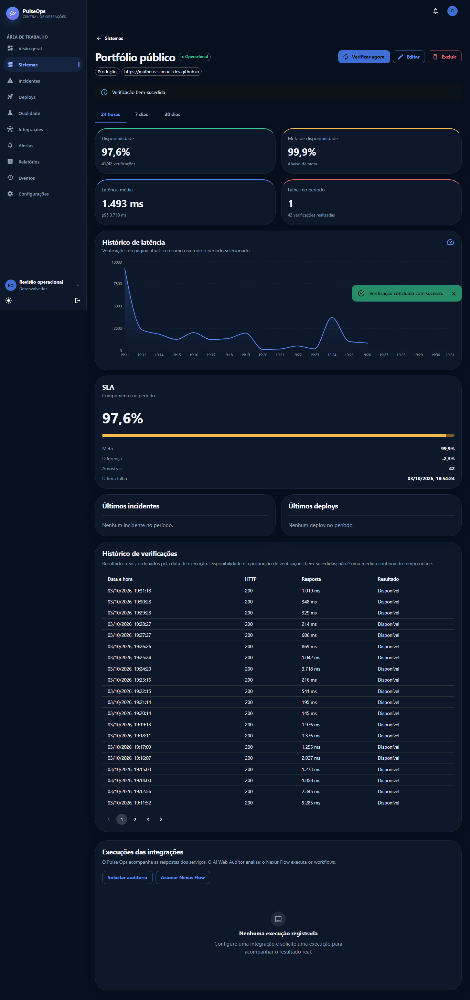

# Revisão completa do Pulse Ops

Revisão realizada em 3 de outubro de 2026. As alterações foram feitas diretamente no projeto. Esta entrega foi validada localmente; publicação em produção e conexão com os serviços externos reais dependem das configurações descritas nas pendências.

## Problemas encontrados

- O seed de desenvolvimento criava sistemas de exemplo, trinta dias de verificações e métricas aleatórias, incidentes, deploys, relatórios e notificações. Reinícios deslocavam datas e restauravam condições simuladas.
- O Compose padrão iniciava em modo demonstrativo/somente leitura, com monitoramento desativado. O login exibia credenciais de exemplo e não havia criação de conta na interface.
- Sistemas e agregações eram compartilhados globalmente. Uma conta nova não tinha um espaço vazio próprio nem isolamento suficiente de recursos relacionados por UUID.
- Sessão persistida sem validação inicial do usuário; logout não revogava os JWT emitidos. “Lembrar” não mudava a persistência.
- Avatares e usuário na sidebar não abriam menu. Não havia um perfil editável conectado ao backend.
- Qualidade mostrava percentuais fixos por camada; destaque de qualidade e gráficos sugeriam evidências inexistentes. Ausência de dados podia virar zero ou estado saudável.
- A timeline era reconstruída a partir de recursos independentes, com origem e horários de investigação presumidos. Não havia uma trilha operacional persistida de cada ação.
- Integrações tinham catálogo, check e relatórios, mas não possuíam configuração por conta nem ciclo de solicitação/resultado dos serviços. Sistemas não configurados pareciam parte de um ecossistema já conectado.
- O detalhe do sistema não tinha paginação de verificações e fazia uma chamada de último relatório que retornava 404 normalmente. Algumas consultas e campos eram redundantes.
- Mensagens de regras de negócio em inglês, textos inconsistentes, labels MUI ignorados por API antiga e configurações sem informação operacional útil.
- Configurações ultrapassava a largura de 360 px. Gráficos de tendência eram montados em uma tabela escondida no mobile e geravam avisos com dimensões zero.
- Um índice global de nome da migration V2 continuava impedindo contas diferentes de usar o mesmo nome, mesmo após acrescentar propriedade dos cadastros.
- A auditoria completa de npm encontrou três vulnerabilidades em dependências de desenvolvimento. Elas foram corrigidas; a auditoria de produção já retornava zero.

## Dados fictícios retirados do fluxo normal

| Local original | Correção |
| --- | --- |
| `backend/src/main/java/com/pulseops/config/DevelopmentDataSeeder.java` | Restrito ao perfil explícito `demo & !prod` e à flag `DEMO_SEED_ENABLED=true`, desativada por padrão. Dados aleatórios ficaram exclusivamente no modo demonstrativo isolado e nos testes. |
| Banco contendo o seed antigo | V5 identifica os nomes, descrições e URLs exatas do seed original, marca demonstração e desativa os sistemas. Não apaga os históricos nem classifica sistemas reais apenas por ter um nome parecido. Consultas normais e scheduler excluem demonstração. |
| `docker-compose.yml`, `.env.example`, configuração Spring e frontend | Padrão com escritas, monitoramento real e demonstração desativada. O Compose de teste tem volume/rede próprios e não é usado no ambiente normal. |
| `frontend/src/pages/QualityPage.tsx` | Percentuais fixos 93,47 / 88,8 / 97,56 / 100 removidos. Cobertura, aprovação e índice vêm de relatórios reais enviados pela API. Sem relatórios, aparece estado vazio. |
| `frontend/src/components/dashboard/QualitySpotlight.tsx` | Componente removido, incluindo sinais de confiança que não provinham de evidências. |
| `frontend/src/components/dashboard/ErrorDonut.tsx` e gráficos | Retirado preenchimento artificial para gráfico sem falhas. Sem amostras, não há série de dados inventada. |
| Dashboard, disponibilidade, SLA e relatórios | Ausência de evidência é `null`/“—”. Disponibilidade e SLA por sistema e média do dashboard exigem cinco verificações no período. A taxa geral de sucesso do relatório é identificada como sucesso das verificações e mostra seu denominador. |
| `frontend/src/pages/AuditPage.tsx` | Timeline substituída por eventos efetivamente persistidos; origem e datas não são projetadas de maneira fictícia. |
| Incidentes, automação e detalhes | Início da indisponibilidade usa a primeira falha observada; investigação e resolução possuem timestamps próprios. Nenhum horário é simulado. |
| Login | Retiradas credenciais demonstrativas no ambiente normal e ações sem implementação, incluindo recuperação fictícia de senha. |
| Integrações | Só AI Web Auditor/Nexus Flow aparecem sem vínculo como opções para configurar. Outros vínculos legados aparecem quando configurados. Métricas usam checks e execuções persistidos; resultado de auditoria não é convertido em cobertura de testes. |

Arrays de opções, enums, cores e nomes de integrações permanecem como metadados de interface. Fixtures de frontend, HTTP local e valores controlados de auditoria ficam exclusivamente em testes. A revisão com uma URL pública registrou respostas efetivas; esse histórico não foi produzido por seed.

## Funcionalidades implementadas e comportamento final

- Criar conta, entrar, lembrar sessão opcionalmente, atualizar a página, consultar o perfil real e sair com revogação dos tokens anteriores da conta.
- Contas novas com papel DEVELOPER gerenciam os próprios sistemas. Administradores mantêm acesso administrativo; cadastros demonstrativos não entram em consultas operacionais normais.
- Cadastro, consulta, edição e exclusão de sistemas, com validação de URL, ambiente, HTTP esperado, timeout, limite de latência e meta.
- Monitoramento manual e automático real; histórico paginado, última falha, HTTP, tempo de resposta, motivo e momento da alteração do estado.
- Dashboard com contagens, problemas, incidentes e métricas obtidas do banco; estado inicial vazio e erro sem substituição por dados falsos.
- Incidentes automáticos e manuais, edição de título/contexto/severidade, investigação, resolução, duração e datas reais.
- Eventos persistidos e paginados, busca com debounce e filtros por sistema/severidade. Exclusão de sistema preserva nome/proprietário no evento.
- Notificações reais de indisponibilidade, recuperação e abertura de incidente para o proprietário.
- Menu único da conta acessível pela sidebar e avatar; perfil, configurações e logout, com teclado, Escape, foco e drawer mobile.
- Edição de nome/e-mail; mudança de e-mail exige senha atual. Avatar usa iniciais. Preferência de tema persiste no dispositivo.
- Configurações exibem parâmetros ativos do monitoramento e encaminham às configurações individuais dos sistemas. Administração da equipe só aparece a administradores.
- Configuração de integrações por conta, credenciais cifradas, teste HTTP, solicitação de ação, histórico e resultado real.
- Fila persistente para entregar SYSTEM_DOWN ao Nexus Flow quando a opção for habilitada; callback autenticado registra o estado do workflow.
- Exportação CSV dos registros reais, filtros e atualizações existentes preservados. Deploys continuam como registros/transições operacionais; o Pulse Ops não executa uma implantação por conta própria.

Incidentes, verificações, relatórios de CI e eventos são evidências operacionais; não receberam exclusão indiscriminada apenas para completar um CRUD visual. Os fluxos de criação, leitura e mudança apropriados a cada recurso foram preservados ou corrigidos.

## Backend

Controllers novos: `ProfileController`, `EventController`, `ConnectionController`, `RuntimeSettingsController`. Controllers de sistemas, métricas, autenticação e recursos relacionados foram ajustados para propriedade, contratos e permissões.

Services principais: `ProfileService`, `EventRecorder`, `ConnectionService`, `IntegrationActionService`, `IntegrationRunPersistence`, `NexusEventDelivery`; ajustes em `MonitoredSystemService`, `UserService`, `AuthService`, `DashboardService`, disponibilidade/SLA/latência, monitoramento/persistência/avaliação de estado, incidentes, qualidade e relatórios.

Segurança: `AccountScope`, JWT/principal/filtro/user details, validação de senha, `IntegrationCredentialCipher`, `ProductionConfigurationGuard`. `IntegrationHttpClient` reutiliza a política SSRF e resolução DNS fixada existente.

Entidades novas: `OperationalEvent`, `IntegrationConnection`, `IntegrationRun`. Sistemas ganharam proprietário, marca de demonstração, motivo/momento do estado e última falha; usuários ganharam versão de sessão e marca de demonstração; incidentes ganharam início da investigação. Repositories e agregações passaram a aplicar escopo de conta.

| Migration incremental | Finalidade |
| --- | --- |
| V4 `account_ownership_and_sessions` | Propriedade, versão de sessão e unicidade de nome por proprietário |
| V5 `quarantine_legacy_demonstration` | Quarentena dos dados demonstrativos antigos sem recriar a base |
| V6 `operational_events` | Eventos, índices, preservação de snapshots e data de investigação |
| V7 `integration_connections_and_runs` | Conexões, credenciais cifradas, histórico e fila/idempotência por evento |
| V8 `monitoring_status_context` | Motivo/momento do estado e última falha a partir de registros reais |
| V9 `remove_legacy_global_name_index` | Retirada do índice global antigo que conflitava com isolamento por conta |

| Endpoint relevante | Comportamento |
| --- | --- |
| POST `/api/auth/register`, POST `/api/auth/login` | Cadastro/login com validação, BCrypt e JWT |
| GET/PUT `/api/account/me`, POST `/api/account/logout` | Perfil, atualização e revogação |
| GET/POST `/api/systems`, GET/PUT/DELETE `/api/systems/{id}` | CRUD protegido por proprietário/papel |
| POST `/api/systems/{id}/checks`, GET histórico/metrics | Verificação real, resultados paginados e métricas |
| GET/POST `/api/incidents`, PATCH `/api/incidents/{id}` e transições | Registro, contexto, investigação e resolução |
| GET `/api/events` | Eventos reais com paginação/filtros |
| GET `/api/settings/monitoring` | Parâmetros operacionais ativos |
| GET `/api/integrations`, detalhes/check | Estado persistido e teste HTTP real |
| GET/PUT/DELETE `/api/connections/{slug}` | Configuração da integração da conta |
| POST `/api/connections/{slug}/actions` | Solicitação de auditoria/workflow |
| GET `/api/connections/runs`, POST refresh, PATCH execução | Histórico, consulta ao Auditor e callback do Nexus |
| POST `/api/quality/reports` | Ingestão de relatórios reais de testes, preservada e protegida |

Os métodos/campos exatos dos contratos são documentados no OpenAPI do backend. A lista completa de arquivos está no inventário ao final.

## Frontend

Páginas revisadas: Login, Cadastro, Perfil, Visão geral, Sistemas, Detalhe do sistema, Incidentes, Deploys, Qualidade, Integrações, Alertas, Relatórios, Eventos e Configurações.

Componentes e infraestrutura principais: `AppShell`, `AuthContext`, `ProtectedRoute`, `AccountMenu` incorporado ao shell, formulários de sistemas, estados vazios/erros, cards, gráficos, tabela de saúde, `ConnectionManager`, `IntegrationRuns`, lista/mapa/detalhes de integrações, serviço central Axios, persistência da sessão e tema MUI em pt-BR.

Hierarquia e identidade foram preservadas. Foram reduzidos pedidos redundantes, removidas informações demonstrativas e corrigidos espaço mínimo dos painéis, grid e textos longos. A tela de Configurações, que tinha overflow e grande área sem função para desenvolvedores, passou a concentrar perfil, aparência e monitoramento.

Contraste dos textos/botões dos temas foi ajustado e recebeu testes; tabelas se adaptam ou possuem rolagem interna. Gráficos desktop não são montados em uma região escondida. O menu real atende teclado/Escape/foco; modais e inputs possuem nomes e validação. Isso não representa certificação completa WCAG com tecnologias assistivas.

## Autenticação

O cadastro cria usuário real no PostgreSQL, usa BCrypt e emite JWT com issuer/expiração/versão. O navegador mantém a sessão na aba por padrão; “lembrar” usa armazenamento local. A inicialização consulta `/account/me`; endpoints continuam validando o token e o usuário no backend.

Perfil salva nome/e-mail no banco; mudança de e-mail exige senha atual e invalida sessões anteriores. Logout incrementa a versão de sessão e revoga JWT previamente emitidos para a conta. Depois de sair, rotas protegidas redirecionam ao login. Senhas não são expostas em respostas.

Não há refresh token, recuperação de senha, verificação de e-mail ou cookie HttpOnly nesta arquitetura. Armazenamento no navegador permanece sujeito ao risco de XSS; CSP, validação e escape de React reduzem a exposição, mas não equivalem a HttpOnly. HTTPS e política de sessão precisam ser mantidos na implantação.

## Origem das métricas e regras do monitoramento

- HTTP/latência: cliente HTTP real com validação DNS/destino, TLS normal, timeout individual e sem redirects. Falha de transporte mantém HTTP e latência de resposta ausentes na UI.
- Estado: resposta esperada, limite de latência, falhas recentes/consecutivas; motivo persiste no cadastro. Alterar o alvo exige nova verificação.
- Disponibilidade/SLA: mínimo cinco amostras no período; sucesso HTTP configurado dividido pelo total. É disponibilidade amostral, não cálculo contínuo de minutos online. O dashboard apresenta a média entre sistemas com histórico suficiente.
- Latência média/p95: somente amostras HTTP do período. Quantidade de falhas, última falha e última verificação vêm dos checks registrados.
- Incidentes: três falhas consecutivas abrem um incidente automático; início é a primeira falha observada; cinco elevam severidade; duas respostas saudáveis consecutivas resolvem. Lentidão pode degradar sem gerar indisponibilidade HTTP fictícia.
- Eventos/notificações: gravações decorrentes de operações/transições reais.
- Qualidade: contadores e cobertura fornecidos por produtor de CI. O índice ponderado já existente usa 60% linhas + 40% ramificações; não inclui dados de camadas inexistentes.
- Auditorias: status e nota retornados pelo AI Web Auditor. Solicitação aceita e conclusão são estados distintos.

## Integrações

O AI Web Auditor recebe POST `/api/audits` com autorização confirmada, URL/nome do alvo e ações destrutivas desativadas. Pulse Ops registra o UUID/status e consulta GET `/api/audits/{id}`. Relatório só é ligado à origem pública configurada quando houver conclusão. Um score de auditoria não vira cobertura de testes.

Nexus Flow recebe webhook manual ou evento SYSTEM_DOWN, com runId/eventId e Idempotency-Key. HTTP 2xx comprova recebimento, não conclusão. O workflow informa RUNNING/COMPLETED/FAILED/CANCELLED pelo callback autenticado do Pulse Ops. O receptor deve deduplicar o identificador. Não há editor de workflows, retries com backoff ou garantia de entrega exatamente uma vez.

Teste de conexão verifica o endpoint HTTP de saúde no backend e registra/reutiliza evidência dentro do cooldown informado; validação de credencial da ação ocorre na chamada da API/webhook. URLs públicas são navegação, não prova de conexão. Tokens são cifrados com chave própria e nunca devolvidos pela API.

Configuração passo a passo, payloads, callbacks e limites: [integrations.md](integrations.md). Nenhuma integração externa real foi apresentada como conectada sem endpoint/credencial fornecidos.

## Segurança

Foram exercitados autenticação/expiração/revogação, permissões, tentativas de IDOR em sistemas/filhos/execuções, validação de payloads, separação de contas e configuração cifrada. A política SSRF existente foi preservada e aplicada também às ações externas: bloqueio de redes privadas/reservadas/metadata, DNS fixado e redirects desativados.

As respostas de erro não expõem stack trace, SQL ou segredo remoto. Integrações têm timeout e limite de tamanho; o Nginx limita login/cadastro e envia CSP, anti-framing e outros cabeçalhos. O perfil prod recusa exemplos de segredo conhecidos, chave JWT igual à chave das integrações, wildcard CORS e flags de demonstração/redes privadas amplas.

A auditoria npm final cobre dependências de produção e desenvolvimento. Não foi realizada uma avaliação externa de penetração nem uma garantia de ausência de vulnerabilidades em toda a cadeia Java/infrastrutura.

## Testes e resultados finais

| Verificação | Executados/aprovados | Falhas/erros/ignorados | Cobertura |
| --- | --- | --- | --- |
| Backend: mvn clean verify | 342/342 | 0 / 0 / 0 | Linhas 93,8% (2528/2695); ramificações 76,08%; services 94,93% em linhas. Gate global mínimo de 85% aprovado. |
| Frontend: npm run test:coverage | 56/56, 14 arquivos | 0 / 0 / 0 | Linhas 39,87% (370/928); ramificações 34,74%; instruções 34,12%; funções 26,9%. |
| Playwright: npm run test:e2e | 4/4 cenários, sete fluxos mínimos | 0 / 0 / 0; sem casos instáveis | Fluxos completos no navegador, API e PostgreSQL. |
| Console/rede/responsividade | 84 combinações: doze páginas × sete larguras | 0 erros/warnings relevantes; 0 HTTP inesperado >=400; 0 overflow | 1920, 1366, 1024, 768, 430, 390 e 360 px. |
| Ambiente normal com URL pública | 12 páginas; HTTP 200, 1019 ms no check final | 0 erros/warnings de navegador; 0 requisições inesperadas | Perfil persistido e logout/rota protegida confirmados. |
| npm audit completo e produção | 0 vulnerabilidades apontadas | 0 críticas / altas / moderadas / baixas | Ferramentas de desenvolvimento corrigidas também. |

Evidências: [resumo JSON](evidence/validation-summary.json), [backend](evidence/backend-verify.log), [frontend](evidence/frontend-tests.log), [JaCoCo](../backend/target/site/jacoco/index.html), [cobertura frontend](evidence/frontend-coverage/index.html), [E2E](evidence/e2e-results.json), [navegação](evidence/browser-audit.json) e [verificação pública](evidence/live-review.json).

Os testes de backend incluem unitários, controllers/RBAC, clientes HTTP reais controlados, Flyway/repositories em PostgreSQL Testcontainers e 17 cenários completos MockMvc → serviços → banco → servidor HTTP. Entre os cenários: registro/login, painel vazio, CRUD, escopo por conta, 503, timeout, incidente/recuperação, perfil/logout, SSRF, contratos de auditoria, credencial recusada, cifragem, fila Nexus e callback.

Os testes de frontend cobrem login/cadastro/perfil, sessão, formulários, dashboard e filtros, loading/erro/retry, eventos/busca, configurações, tema/contraste, integrações e comportamento responsivo de componentes. Cobertura unitária não inclui execução de navegador E2E.

Os quatro cenários Playwright agrupam os sete fluxos mínimos solicitados. A inspeção percorre doze páginas em sete larguras, mede overflow, testa teclado/menu/sidebar/drawer/tema e registra erros/warnings do console e respostas HTTP >=400. Os testes de indisponibilidade/auditoria/webhook usam servidor controlado exclusivamente no ambiente de teste; o monitoramento público foi verificado separadamente no ambiente normal.

Houve falhas durante a revisão: assertions antigas após novas regras, corrupção de cobertura por execuções sobrepostas, disputas de tempo sob builds concorrentes, duas sincronizações incorretas do roteiro E2E, overflow de Configurações, label do tema e gráficos escondidos. Foram corrigidas/reexecutadas; os números acima são da execução final, não a soma de tentativas.

## Build e Docker

| Build/operação | Resultado final | Evidência |
| --- | --- | --- |
| Backend: mvn clean verify | BUILD SUCCESS, JAR gerado e gate JaCoCo aprovado | backend-verify.log |
| Frontend: npm run build | TypeScript e Vite aprovados | frontend-build.log |
| Frontend: npm run lint | 0 erros/avisos do ESLint | frontend-lint.log |
| Docker: docker compose build | Imagens backend/frontend construídas; frontend reconstruído após os textos finais | docker-build.log, docker-build-frontend-final.log |
| Docker Compose normal: up -d --wait | PostgreSQL, backend e frontend saudáveis | docker-compose.log, docker-services.json |
| Compose isolado: up -d --build --wait | Quatro serviços saudáveis, incluindo fixture HTTP | docker-compose-test.log, docker-test-services.json |
| Flyway no banco preservado | V1 a V9 aplicadas com sucesso | flyway-applied.txt |

O banco normal e seu volume foram preservados. Migrations foram aplicadas incrementalmente; o ambiente controlado usa nome, rede, portas e volume próprios. Não foi usado `down -v` no banco normal. Serviços de outros projetos existentes no Docker foram preservados.

## Pendências e limites explícitos

| O que falta | Motivo | Como configurar e validar |
| --- | --- | --- |
| AI Web Auditor real | Endpoint público e token reais não fornecidos para esta conta | Cadastre seu serviço remoto, configure token/caminho `/api/audits` e origem pública; teste HTTP, solicite auditoria autorizada, consulte até concluir e abra `/audits/{id}`. Contrato foi validado com servidor controlado. |
| Nexus Flow real | Contrato/repositório do serviço não disponível neste workspace; workflow publicado não fornecido | Publique webhook que aceite o payload documentado, configure Bearer se exigido, use Idempotency-Key e implemente callback autenticado da conta. Force indisponibilidade em alvo autorizado e confira evento, recebimento e conclusão. |
| Domínio/TLS/secrets de produção | Infraestrutura e credenciais de produção não foram provisionadas nesta revisão | Configure perfil prod, segredos aleatórios distintos, senha própria do PostgreSQL, CORS exato, proxy HTTPS e backups. Siga README, suba Compose, confira saúde e repita os fluxos usando seu domínio. |
| Relatórios reais de CI | Não existe um pipeline produtor conectado para cada novo sistema | Envie resultados verdadeiros a POST `/api/quality/reports` autenticado pela conta proprietária. Confira histórico/contadores/cobertura; sem produtor, a tela permanece vazia. |
| Sistemas privados | Bloqueados deliberadamente pela política SSRF normal/prod | Utilize gateway público autenticado ou conectividade de infraestrutura com política de saída específica. O acesso amplo liberado no Compose de teste não é uma solução de produção. |
| Callback duradouro do Nexus | JWT de conta possui expiração; não há credencial de serviço permanente/HMAC | O workflow precisa obter sessão válida de uma conta dedicada e lidar com expiração/revogação. Não embuta senha/token no frontend. |
| Maior cobertura unitária do frontend e revisão assistiva completa | A medição atual é parcial, apesar dos fluxos completos de navegador | Ampliar testes das páginas/branches ainda não cobertas e validar com leitor de tela. Não declarar 100% de cobertura ou conformidade WCAG. |
| Operação com múltiplas réplicas/alto volume | Scheduler/fila foram validados em uma instância; cooldown não é lock distribuído | Antes de escalar, adicionar coordenação entre workers, retenção/arquivamento e política de retries. Receptor Nexus deve deduplicar. |

Nenhuma publicação externa foi feita. O sistema está funcional no ambiente local validado; a autorização de uma produção real depende de configurar e testar esses destinos e controles operacionais. Não foram inventadas chaves, workflows ou resultados externos para encobrir dependências.

## Arquivos criados, alterados e removidos

Inventário por SHA-256 do início da revisão, excluindo dependências instaladas, build e temporários. O utilitário do inventário foi criado antes da fotografia inicial e é classificado explicitamente como novo. São 53 arquivos criados, 108 alterados e 1 removido no código/configuração/documentação. Outputs gerados estão separados em [artifact-inventory.json](evidence/artifact-inventory.json); o inventário de fontes está em [changed-files.json](evidence/changed-files.json).

### Criados (53)

- [backend/src/main/java/com/pulseops/client/IntegrationHttpClient.java](<C:/Users/LENOVO/Documents/ChatGPT/PulseOps/backend/src/main/java/com/pulseops/client/IntegrationHttpClient.java>)
- [backend/src/main/java/com/pulseops/controller/ConnectionController.java](<C:/Users/LENOVO/Documents/ChatGPT/PulseOps/backend/src/main/java/com/pulseops/controller/ConnectionController.java>)
- [backend/src/main/java/com/pulseops/controller/EventController.java](<C:/Users/LENOVO/Documents/ChatGPT/PulseOps/backend/src/main/java/com/pulseops/controller/EventController.java>)
- [backend/src/main/java/com/pulseops/controller/ProfileController.java](<C:/Users/LENOVO/Documents/ChatGPT/PulseOps/backend/src/main/java/com/pulseops/controller/ProfileController.java>)
- [backend/src/main/java/com/pulseops/controller/RuntimeSettingsController.java](<C:/Users/LENOVO/Documents/ChatGPT/PulseOps/backend/src/main/java/com/pulseops/controller/RuntimeSettingsController.java>)
- [backend/src/main/java/com/pulseops/domain/event/OperationalEvent.java](<C:/Users/LENOVO/Documents/ChatGPT/PulseOps/backend/src/main/java/com/pulseops/domain/event/OperationalEvent.java>)
- [backend/src/main/java/com/pulseops/domain/integration/IntegrationConnection.java](<C:/Users/LENOVO/Documents/ChatGPT/PulseOps/backend/src/main/java/com/pulseops/domain/integration/IntegrationConnection.java>)
- [backend/src/main/java/com/pulseops/domain/integration/IntegrationRun.java](<C:/Users/LENOVO/Documents/ChatGPT/PulseOps/backend/src/main/java/com/pulseops/domain/integration/IntegrationRun.java>)
- [backend/src/main/java/com/pulseops/dto/incident/UpdateIncidentRequest.java](<C:/Users/LENOVO/Documents/ChatGPT/PulseOps/backend/src/main/java/com/pulseops/dto/incident/UpdateIncidentRequest.java>)
- [backend/src/main/java/com/pulseops/dto/integration/ConnectionRequest.java](<C:/Users/LENOVO/Documents/ChatGPT/PulseOps/backend/src/main/java/com/pulseops/dto/integration/ConnectionRequest.java>)
- [backend/src/main/java/com/pulseops/dto/user/ProfileRequest.java](<C:/Users/LENOVO/Documents/ChatGPT/PulseOps/backend/src/main/java/com/pulseops/dto/user/ProfileRequest.java>)
- [backend/src/main/java/com/pulseops/repository/IntegrationConnectionRepository.java](<C:/Users/LENOVO/Documents/ChatGPT/PulseOps/backend/src/main/java/com/pulseops/repository/IntegrationConnectionRepository.java>)
- [backend/src/main/java/com/pulseops/repository/IntegrationRunRepository.java](<C:/Users/LENOVO/Documents/ChatGPT/PulseOps/backend/src/main/java/com/pulseops/repository/IntegrationRunRepository.java>)
- [backend/src/main/java/com/pulseops/repository/OperationalEventRepository.java](<C:/Users/LENOVO/Documents/ChatGPT/PulseOps/backend/src/main/java/com/pulseops/repository/OperationalEventRepository.java>)
- [backend/src/main/java/com/pulseops/security/AccountScope.java](<C:/Users/LENOVO/Documents/ChatGPT/PulseOps/backend/src/main/java/com/pulseops/security/AccountScope.java>)
- [backend/src/main/java/com/pulseops/security/IntegrationCredentialCipher.java](<C:/Users/LENOVO/Documents/ChatGPT/PulseOps/backend/src/main/java/com/pulseops/security/IntegrationCredentialCipher.java>)
- [backend/src/main/java/com/pulseops/security/ProductionConfigurationGuard.java](<C:/Users/LENOVO/Documents/ChatGPT/PulseOps/backend/src/main/java/com/pulseops/security/ProductionConfigurationGuard.java>)
- [backend/src/main/java/com/pulseops/service/EventRecorder.java](<C:/Users/LENOVO/Documents/ChatGPT/PulseOps/backend/src/main/java/com/pulseops/service/EventRecorder.java>)
- [backend/src/main/java/com/pulseops/service/ProfileService.java](<C:/Users/LENOVO/Documents/ChatGPT/PulseOps/backend/src/main/java/com/pulseops/service/ProfileService.java>)
- [backend/src/main/java/com/pulseops/service/integration/ConnectionService.java](<C:/Users/LENOVO/Documents/ChatGPT/PulseOps/backend/src/main/java/com/pulseops/service/integration/ConnectionService.java>)
- [backend/src/main/java/com/pulseops/service/integration/IntegrationActionService.java](<C:/Users/LENOVO/Documents/ChatGPT/PulseOps/backend/src/main/java/com/pulseops/service/integration/IntegrationActionService.java>)
- [backend/src/main/java/com/pulseops/service/integration/IntegrationRunPersistence.java](<C:/Users/LENOVO/Documents/ChatGPT/PulseOps/backend/src/main/java/com/pulseops/service/integration/IntegrationRunPersistence.java>)
- [backend/src/main/java/com/pulseops/service/integration/NexusEventDelivery.java](<C:/Users/LENOVO/Documents/ChatGPT/PulseOps/backend/src/main/java/com/pulseops/service/integration/NexusEventDelivery.java>)
- [backend/src/main/resources/db/migration/V4__account_ownership_and_sessions.sql](<C:/Users/LENOVO/Documents/ChatGPT/PulseOps/backend/src/main/resources/db/migration/V4__account_ownership_and_sessions.sql>)
- [backend/src/main/resources/db/migration/V5__quarantine_legacy_demonstration.sql](<C:/Users/LENOVO/Documents/ChatGPT/PulseOps/backend/src/main/resources/db/migration/V5__quarantine_legacy_demonstration.sql>)
- [backend/src/main/resources/db/migration/V6__operational_events.sql](<C:/Users/LENOVO/Documents/ChatGPT/PulseOps/backend/src/main/resources/db/migration/V6__operational_events.sql>)
- [backend/src/main/resources/db/migration/V7__integration_connections_and_runs.sql](<C:/Users/LENOVO/Documents/ChatGPT/PulseOps/backend/src/main/resources/db/migration/V7__integration_connections_and_runs.sql>)
- [backend/src/main/resources/db/migration/V8__monitoring_status_context.sql](<C:/Users/LENOVO/Documents/ChatGPT/PulseOps/backend/src/main/resources/db/migration/V8__monitoring_status_context.sql>)
- [backend/src/main/resources/db/migration/V9__remove_legacy_global_name_index.sql](<C:/Users/LENOVO/Documents/ChatGPT/PulseOps/backend/src/main/resources/db/migration/V9__remove_legacy_global_name_index.sql>)
- [backend/src/test/java/com/pulseops/integration/OperationalFlowIntegrationTest.java](<C:/Users/LENOVO/Documents/ChatGPT/PulseOps/backend/src/test/java/com/pulseops/integration/OperationalFlowIntegrationTest.java>)
- [backend/src/test/java/com/pulseops/security/IntegrationCredentialCipherTest.java](<C:/Users/LENOVO/Documents/ChatGPT/PulseOps/backend/src/test/java/com/pulseops/security/IntegrationCredentialCipherTest.java>)
- [backend/src/test/java/com/pulseops/security/ProductionConfigurationGuardTest.java](<C:/Users/LENOVO/Documents/ChatGPT/PulseOps/backend/src/test/java/com/pulseops/security/ProductionConfigurationGuardTest.java>)
- [docker-compose.test.yml](<C:/Users/LENOVO/Documents/ChatGPT/PulseOps/docker-compose.test.yml>)
- [docs/revisao-pulseops.md](<C:/Users/LENOVO/Documents/ChatGPT/PulseOps/docs/revisao-pulseops.md>)
- [frontend/e2e/operations.spec.ts](<C:/Users/LENOVO/Documents/ChatGPT/PulseOps/frontend/e2e/operations.spec.ts>)
- [frontend/playwright.config.ts](<C:/Users/LENOVO/Documents/ChatGPT/PulseOps/frontend/playwright.config.ts>)
- [frontend/src/components/integrations/ConnectionManager.tsx](<C:/Users/LENOVO/Documents/ChatGPT/PulseOps/frontend/src/components/integrations/ConnectionManager.tsx>)
- [frontend/src/components/integrations/IntegrationRuns.tsx](<C:/Users/LENOVO/Documents/ChatGPT/PulseOps/frontend/src/components/integrations/IntegrationRuns.tsx>)
- [frontend/src/components/systems/SystemFormDialog.test.tsx](<C:/Users/LENOVO/Documents/ChatGPT/PulseOps/frontend/src/components/systems/SystemFormDialog.test.tsx>)
- [frontend/src/pages/AccountFlows.test.tsx](<C:/Users/LENOVO/Documents/ChatGPT/PulseOps/frontend/src/pages/AccountFlows.test.tsx>)
- [frontend/src/pages/AuditPage.test.tsx](<C:/Users/LENOVO/Documents/ChatGPT/PulseOps/frontend/src/pages/AuditPage.test.tsx>)
- [frontend/src/pages/DashboardPage.test.tsx](<C:/Users/LENOVO/Documents/ChatGPT/PulseOps/frontend/src/pages/DashboardPage.test.tsx>)
- [frontend/src/pages/ProfilePage.tsx](<C:/Users/LENOVO/Documents/ChatGPT/PulseOps/frontend/src/pages/ProfilePage.tsx>)
- [frontend/src/pages/RegisterPage.tsx](<C:/Users/LENOVO/Documents/ChatGPT/PulseOps/frontend/src/pages/RegisterPage.tsx>)
- [frontend/src/pages/SettingsPage.test.tsx](<C:/Users/LENOVO/Documents/ChatGPT/PulseOps/frontend/src/pages/SettingsPage.test.tsx>)
- [frontend/src/services/connectionsService.ts](<C:/Users/LENOVO/Documents/ChatGPT/PulseOps/frontend/src/services/connectionsService.ts>)
- [frontend/src/services/eventsService.ts](<C:/Users/LENOVO/Documents/ChatGPT/PulseOps/frontend/src/services/eventsService.ts>)
- [frontend/src/theme/PulseOpsThemeProvider.test.tsx](<C:/Users/LENOVO/Documents/ChatGPT/PulseOps/frontend/src/theme/PulseOpsThemeProvider.test.tsx>)
- [scripts/review-live.mjs](<C:/Users/LENOVO/Documents/ChatGPT/PulseOps/scripts/review-live.mjs>)
- [scripts/review-manifest.mjs](<C:/Users/LENOVO/Documents/ChatGPT/PulseOps/scripts/review-manifest.mjs>)
- [scripts/review-report.mjs](<C:/Users/LENOVO/Documents/ChatGPT/PulseOps/scripts/review-report.mjs>)
- [scripts/review-results.mjs](<C:/Users/LENOVO/Documents/ChatGPT/PulseOps/scripts/review-results.mjs>)
- [tests/fixtures/server.mjs](<C:/Users/LENOVO/Documents/ChatGPT/PulseOps/tests/fixtures/server.mjs>)

### Alterados (108)

- [.env.example](<C:/Users/LENOVO/Documents/ChatGPT/PulseOps/.env.example>)
- [README.md](<C:/Users/LENOVO/Documents/ChatGPT/PulseOps/README.md>)
- [backend/src/main/java/com/pulseops/config/DevelopmentDataSeeder.java](<C:/Users/LENOVO/Documents/ChatGPT/PulseOps/backend/src/main/java/com/pulseops/config/DevelopmentDataSeeder.java>)
- [backend/src/main/java/com/pulseops/controller/AuthController.java](<C:/Users/LENOVO/Documents/ChatGPT/PulseOps/backend/src/main/java/com/pulseops/controller/AuthController.java>)
- [backend/src/main/java/com/pulseops/controller/IncidentController.java](<C:/Users/LENOVO/Documents/ChatGPT/PulseOps/backend/src/main/java/com/pulseops/controller/IncidentController.java>)
- [backend/src/main/java/com/pulseops/controller/MonitoredSystemController.java](<C:/Users/LENOVO/Documents/ChatGPT/PulseOps/backend/src/main/java/com/pulseops/controller/MonitoredSystemController.java>)
- [backend/src/main/java/com/pulseops/domain/incident/Incident.java](<C:/Users/LENOVO/Documents/ChatGPT/PulseOps/backend/src/main/java/com/pulseops/domain/incident/Incident.java>)
- [backend/src/main/java/com/pulseops/domain/system/MonitoredSystem.java](<C:/Users/LENOVO/Documents/ChatGPT/PulseOps/backend/src/main/java/com/pulseops/domain/system/MonitoredSystem.java>)
- [backend/src/main/java/com/pulseops/domain/user/User.java](<C:/Users/LENOVO/Documents/ChatGPT/PulseOps/backend/src/main/java/com/pulseops/domain/user/User.java>)
- [backend/src/main/java/com/pulseops/dto/dashboard/SystemHealthResponse.java](<C:/Users/LENOVO/Documents/ChatGPT/PulseOps/backend/src/main/java/com/pulseops/dto/dashboard/SystemHealthResponse.java>)
- [backend/src/main/java/com/pulseops/dto/incident/IncidentResponse.java](<C:/Users/LENOVO/Documents/ChatGPT/PulseOps/backend/src/main/java/com/pulseops/dto/incident/IncidentResponse.java>)
- [backend/src/main/java/com/pulseops/dto/system/MonitoredSystemRequest.java](<C:/Users/LENOVO/Documents/ChatGPT/PulseOps/backend/src/main/java/com/pulseops/dto/system/MonitoredSystemRequest.java>)
- [backend/src/main/java/com/pulseops/dto/system/MonitoredSystemResponse.java](<C:/Users/LENOVO/Documents/ChatGPT/PulseOps/backend/src/main/java/com/pulseops/dto/system/MonitoredSystemResponse.java>)
- [backend/src/main/java/com/pulseops/exception/InvalidStateTransitionException.java](<C:/Users/LENOVO/Documents/ChatGPT/PulseOps/backend/src/main/java/com/pulseops/exception/InvalidStateTransitionException.java>)
- [backend/src/main/java/com/pulseops/exception/ResourceNotFoundException.java](<C:/Users/LENOVO/Documents/ChatGPT/PulseOps/backend/src/main/java/com/pulseops/exception/ResourceNotFoundException.java>)
- [backend/src/main/java/com/pulseops/repository/DeploymentRepository.java](<C:/Users/LENOVO/Documents/ChatGPT/PulseOps/backend/src/main/java/com/pulseops/repository/DeploymentRepository.java>)
- [backend/src/main/java/com/pulseops/repository/HealthCheckRepository.java](<C:/Users/LENOVO/Documents/ChatGPT/PulseOps/backend/src/main/java/com/pulseops/repository/HealthCheckRepository.java>)
- [backend/src/main/java/com/pulseops/repository/IncidentRepository.java](<C:/Users/LENOVO/Documents/ChatGPT/PulseOps/backend/src/main/java/com/pulseops/repository/IncidentRepository.java>)
- [backend/src/main/java/com/pulseops/repository/MonitoredSystemRepository.java](<C:/Users/LENOVO/Documents/ChatGPT/PulseOps/backend/src/main/java/com/pulseops/repository/MonitoredSystemRepository.java>)
- [backend/src/main/java/com/pulseops/repository/TestReportRepository.java](<C:/Users/LENOVO/Documents/ChatGPT/PulseOps/backend/src/main/java/com/pulseops/repository/TestReportRepository.java>)
- [backend/src/main/java/com/pulseops/repository/UserRepository.java](<C:/Users/LENOVO/Documents/ChatGPT/PulseOps/backend/src/main/java/com/pulseops/repository/UserRepository.java>)
- [backend/src/main/java/com/pulseops/security/JwtService.java](<C:/Users/LENOVO/Documents/ChatGPT/PulseOps/backend/src/main/java/com/pulseops/security/JwtService.java>)
- [backend/src/main/java/com/pulseops/security/PulseOpsPrincipal.java](<C:/Users/LENOVO/Documents/ChatGPT/PulseOps/backend/src/main/java/com/pulseops/security/PulseOpsPrincipal.java>)
- [backend/src/main/java/com/pulseops/security/PulseOpsUserDetailsService.java](<C:/Users/LENOVO/Documents/ChatGPT/PulseOps/backend/src/main/java/com/pulseops/security/PulseOpsUserDetailsService.java>)
- [backend/src/main/java/com/pulseops/service/AuthService.java](<C:/Users/LENOVO/Documents/ChatGPT/PulseOps/backend/src/main/java/com/pulseops/service/AuthService.java>)
- [backend/src/main/java/com/pulseops/service/DashboardService.java](<C:/Users/LENOVO/Documents/ChatGPT/PulseOps/backend/src/main/java/com/pulseops/service/DashboardService.java>)
- [backend/src/main/java/com/pulseops/service/MonitoredSystemService.java](<C:/Users/LENOVO/Documents/ChatGPT/PulseOps/backend/src/main/java/com/pulseops/service/MonitoredSystemService.java>)
- [backend/src/main/java/com/pulseops/service/UserService.java](<C:/Users/LENOVO/Documents/ChatGPT/PulseOps/backend/src/main/java/com/pulseops/service/UserService.java>)
- [backend/src/main/java/com/pulseops/service/deployment/DeploymentService.java](<C:/Users/LENOVO/Documents/ChatGPT/PulseOps/backend/src/main/java/com/pulseops/service/deployment/DeploymentService.java>)
- [backend/src/main/java/com/pulseops/service/incident/IncidentAutomationService.java](<C:/Users/LENOVO/Documents/ChatGPT/PulseOps/backend/src/main/java/com/pulseops/service/incident/IncidentAutomationService.java>)
- [backend/src/main/java/com/pulseops/service/incident/IncidentService.java](<C:/Users/LENOVO/Documents/ChatGPT/PulseOps/backend/src/main/java/com/pulseops/service/incident/IncidentService.java>)
- [backend/src/main/java/com/pulseops/service/integration/IntegrationCatalog.java](<C:/Users/LENOVO/Documents/ChatGPT/PulseOps/backend/src/main/java/com/pulseops/service/integration/IntegrationCatalog.java>)
- [backend/src/main/java/com/pulseops/service/integration/IntegrationService.java](<C:/Users/LENOVO/Documents/ChatGPT/PulseOps/backend/src/main/java/com/pulseops/service/integration/IntegrationService.java>)
- [backend/src/main/java/com/pulseops/service/monitoring/AvailabilityService.java](<C:/Users/LENOVO/Documents/ChatGPT/PulseOps/backend/src/main/java/com/pulseops/service/monitoring/AvailabilityService.java>)
- [backend/src/main/java/com/pulseops/service/monitoring/LatencyMetricsService.java](<C:/Users/LENOVO/Documents/ChatGPT/PulseOps/backend/src/main/java/com/pulseops/service/monitoring/LatencyMetricsService.java>)
- [backend/src/main/java/com/pulseops/service/monitoring/MonitoringPersistenceService.java](<C:/Users/LENOVO/Documents/ChatGPT/PulseOps/backend/src/main/java/com/pulseops/service/monitoring/MonitoringPersistenceService.java>)
- [backend/src/main/java/com/pulseops/service/monitoring/MonitoringService.java](<C:/Users/LENOVO/Documents/ChatGPT/PulseOps/backend/src/main/java/com/pulseops/service/monitoring/MonitoringService.java>)
- [backend/src/main/java/com/pulseops/service/monitoring/MonitoringStatusEvaluator.java](<C:/Users/LENOVO/Documents/ChatGPT/PulseOps/backend/src/main/java/com/pulseops/service/monitoring/MonitoringStatusEvaluator.java>)
- [backend/src/main/java/com/pulseops/service/monitoring/SlaService.java](<C:/Users/LENOVO/Documents/ChatGPT/PulseOps/backend/src/main/java/com/pulseops/service/monitoring/SlaService.java>)
- [backend/src/main/java/com/pulseops/service/quality/QualityService.java](<C:/Users/LENOVO/Documents/ChatGPT/PulseOps/backend/src/main/java/com/pulseops/service/quality/QualityService.java>)
- [backend/src/main/java/com/pulseops/service/report/OperationalReportService.java](<C:/Users/LENOVO/Documents/ChatGPT/PulseOps/backend/src/main/java/com/pulseops/service/report/OperationalReportService.java>)
- [backend/src/main/resources/application.yml](<C:/Users/LENOVO/Documents/ChatGPT/PulseOps/backend/src/main/resources/application.yml>)
- [backend/src/test/java/com/pulseops/client/WebClientHealthCheckClientTest.java](<C:/Users/LENOVO/Documents/ChatGPT/PulseOps/backend/src/test/java/com/pulseops/client/WebClientHealthCheckClientTest.java>)
- [backend/src/test/java/com/pulseops/controller/MonitoredSystemControllerTest.java](<C:/Users/LENOVO/Documents/ChatGPT/PulseOps/backend/src/test/java/com/pulseops/controller/MonitoredSystemControllerTest.java>)
- [backend/src/test/java/com/pulseops/exception/GlobalExceptionHandlerTest.java](<C:/Users/LENOVO/Documents/ChatGPT/PulseOps/backend/src/test/java/com/pulseops/exception/GlobalExceptionHandlerTest.java>)
- [backend/src/test/java/com/pulseops/service/AuthServiceTest.java](<C:/Users/LENOVO/Documents/ChatGPT/PulseOps/backend/src/test/java/com/pulseops/service/AuthServiceTest.java>)
- [backend/src/test/java/com/pulseops/service/DashboardServiceTest.java](<C:/Users/LENOVO/Documents/ChatGPT/PulseOps/backend/src/test/java/com/pulseops/service/DashboardServiceTest.java>)
- [backend/src/test/java/com/pulseops/service/MonitoredSystemServiceTest.java](<C:/Users/LENOVO/Documents/ChatGPT/PulseOps/backend/src/test/java/com/pulseops/service/MonitoredSystemServiceTest.java>)
- [backend/src/test/java/com/pulseops/service/deployment/DeploymentServiceTest.java](<C:/Users/LENOVO/Documents/ChatGPT/PulseOps/backend/src/test/java/com/pulseops/service/deployment/DeploymentServiceTest.java>)
- [backend/src/test/java/com/pulseops/service/incident/IncidentAutomationServiceTest.java](<C:/Users/LENOVO/Documents/ChatGPT/PulseOps/backend/src/test/java/com/pulseops/service/incident/IncidentAutomationServiceTest.java>)
- [backend/src/test/java/com/pulseops/service/incident/IncidentServiceTest.java](<C:/Users/LENOVO/Documents/ChatGPT/PulseOps/backend/src/test/java/com/pulseops/service/incident/IncidentServiceTest.java>)
- [backend/src/test/java/com/pulseops/service/integration/IntegrationServiceTest.java](<C:/Users/LENOVO/Documents/ChatGPT/PulseOps/backend/src/test/java/com/pulseops/service/integration/IntegrationServiceTest.java>)
- [backend/src/test/java/com/pulseops/service/monitoring/AvailabilityServiceTest.java](<C:/Users/LENOVO/Documents/ChatGPT/PulseOps/backend/src/test/java/com/pulseops/service/monitoring/AvailabilityServiceTest.java>)
- [backend/src/test/java/com/pulseops/service/monitoring/LatencyMetricsServiceTest.java](<C:/Users/LENOVO/Documents/ChatGPT/PulseOps/backend/src/test/java/com/pulseops/service/monitoring/LatencyMetricsServiceTest.java>)
- [backend/src/test/java/com/pulseops/service/monitoring/MonitoringPersistenceServiceTest.java](<C:/Users/LENOVO/Documents/ChatGPT/PulseOps/backend/src/test/java/com/pulseops/service/monitoring/MonitoringPersistenceServiceTest.java>)
- [backend/src/test/java/com/pulseops/service/monitoring/MonitoringServiceTest.java](<C:/Users/LENOVO/Documents/ChatGPT/PulseOps/backend/src/test/java/com/pulseops/service/monitoring/MonitoringServiceTest.java>)
- [backend/src/test/java/com/pulseops/service/monitoring/MonitoringStatusEvaluatorTest.java](<C:/Users/LENOVO/Documents/ChatGPT/PulseOps/backend/src/test/java/com/pulseops/service/monitoring/MonitoringStatusEvaluatorTest.java>)
- [backend/src/test/java/com/pulseops/service/monitoring/SlaServiceTest.java](<C:/Users/LENOVO/Documents/ChatGPT/PulseOps/backend/src/test/java/com/pulseops/service/monitoring/SlaServiceTest.java>)
- [backend/src/test/java/com/pulseops/service/quality/QualityServiceTest.java](<C:/Users/LENOVO/Documents/ChatGPT/PulseOps/backend/src/test/java/com/pulseops/service/quality/QualityServiceTest.java>)
- [backend/src/test/java/com/pulseops/service/report/OperationalReportServiceTest.java](<C:/Users/LENOVO/Documents/ChatGPT/PulseOps/backend/src/test/java/com/pulseops/service/report/OperationalReportServiceTest.java>)
- [docker-compose.yml](<C:/Users/LENOVO/Documents/ChatGPT/PulseOps/docker-compose.yml>)
- [docs/integrations-delivery.md](<C:/Users/LENOVO/Documents/ChatGPT/PulseOps/docs/integrations-delivery.md>)
- [docs/integrations.md](<C:/Users/LENOVO/Documents/ChatGPT/PulseOps/docs/integrations.md>)
- [frontend/index.html](<C:/Users/LENOVO/Documents/ChatGPT/PulseOps/frontend/index.html>)
- [frontend/nginx.conf](<C:/Users/LENOVO/Documents/ChatGPT/PulseOps/frontend/nginx.conf>)
- [frontend/package-lock.json](<C:/Users/LENOVO/Documents/ChatGPT/PulseOps/frontend/package-lock.json>)
- [frontend/package.json](<C:/Users/LENOVO/Documents/ChatGPT/PulseOps/frontend/package.json>)
- [frontend/public/site.webmanifest](<C:/Users/LENOVO/Documents/ChatGPT/PulseOps/frontend/public/site.webmanifest>)
- [frontend/src/App.tsx](<C:/Users/LENOVO/Documents/ChatGPT/PulseOps/frontend/src/App.tsx>)
- [frontend/src/auth/AuthContext.tsx](<C:/Users/LENOVO/Documents/ChatGPT/PulseOps/frontend/src/auth/AuthContext.tsx>)
- [frontend/src/components/common/Panel.tsx](<C:/Users/LENOVO/Documents/ChatGPT/PulseOps/frontend/src/components/common/Panel.tsx>)
- [frontend/src/components/common/PulseOpsLogo.tsx](<C:/Users/LENOVO/Documents/ChatGPT/PulseOps/frontend/src/components/common/PulseOpsLogo.tsx>)
- [frontend/src/components/dashboard/ErrorDonut.tsx](<C:/Users/LENOVO/Documents/ChatGPT/PulseOps/frontend/src/components/dashboard/ErrorDonut.tsx>)
- [frontend/src/components/dashboard/KpiCard.tsx](<C:/Users/LENOVO/Documents/ChatGPT/PulseOps/frontend/src/components/dashboard/KpiCard.tsx>)
- [frontend/src/components/dashboard/LatencyChart.tsx](<C:/Users/LENOVO/Documents/ChatGPT/PulseOps/frontend/src/components/dashboard/LatencyChart.tsx>)
- [frontend/src/components/dashboard/SystemHealthTable.tsx](<C:/Users/LENOVO/Documents/ChatGPT/PulseOps/frontend/src/components/dashboard/SystemHealthTable.tsx>)
- [frontend/src/components/dashboard/SystemStatusChip.tsx](<C:/Users/LENOVO/Documents/ChatGPT/PulseOps/frontend/src/components/dashboard/SystemStatusChip.tsx>)
- [frontend/src/components/dashboard/dashboardFormatters.ts](<C:/Users/LENOVO/Documents/ChatGPT/PulseOps/frontend/src/components/dashboard/dashboardFormatters.ts>)
- [frontend/src/components/integrations/IntegrationActivity.tsx](<C:/Users/LENOVO/Documents/ChatGPT/PulseOps/frontend/src/components/integrations/IntegrationActivity.tsx>)
- [frontend/src/components/integrations/IntegrationDetails.tsx](<C:/Users/LENOVO/Documents/ChatGPT/PulseOps/frontend/src/components/integrations/IntegrationDetails.tsx>)
- [frontend/src/components/integrations/IntegrationList.tsx](<C:/Users/LENOVO/Documents/ChatGPT/PulseOps/frontend/src/components/integrations/IntegrationList.tsx>)
- [frontend/src/components/integrations/IntegrationMap.tsx](<C:/Users/LENOVO/Documents/ChatGPT/PulseOps/frontend/src/components/integrations/IntegrationMap.tsx>)
- [frontend/src/components/integrations/IntegrationPrimitives.tsx](<C:/Users/LENOVO/Documents/ChatGPT/PulseOps/frontend/src/components/integrations/IntegrationPrimitives.tsx>)
- [frontend/src/components/integrations/IntegrationSpotlight.tsx](<C:/Users/LENOVO/Documents/ChatGPT/PulseOps/frontend/src/components/integrations/IntegrationSpotlight.tsx>)
- [frontend/src/components/integrations/integrationPresentation.ts](<C:/Users/LENOVO/Documents/ChatGPT/PulseOps/frontend/src/components/integrations/integrationPresentation.ts>)
- [frontend/src/components/systems/SystemFormDialog.tsx](<C:/Users/LENOVO/Documents/ChatGPT/PulseOps/frontend/src/components/systems/SystemFormDialog.tsx>)
- [frontend/src/layout/AppShell.tsx](<C:/Users/LENOVO/Documents/ChatGPT/PulseOps/frontend/src/layout/AppShell.tsx>)
- [frontend/src/pages/AuditPage.tsx](<C:/Users/LENOVO/Documents/ChatGPT/PulseOps/frontend/src/pages/AuditPage.tsx>)
- [frontend/src/pages/DashboardPage.tsx](<C:/Users/LENOVO/Documents/ChatGPT/PulseOps/frontend/src/pages/DashboardPage.tsx>)
- [frontend/src/pages/DeploymentsPage.tsx](<C:/Users/LENOVO/Documents/ChatGPT/PulseOps/frontend/src/pages/DeploymentsPage.tsx>)
- [frontend/src/pages/IncidentsPage.tsx](<C:/Users/LENOVO/Documents/ChatGPT/PulseOps/frontend/src/pages/IncidentsPage.tsx>)
- [frontend/src/pages/IntegrationsPage.test.tsx](<C:/Users/LENOVO/Documents/ChatGPT/PulseOps/frontend/src/pages/IntegrationsPage.test.tsx>)
- [frontend/src/pages/IntegrationsPage.tsx](<C:/Users/LENOVO/Documents/ChatGPT/PulseOps/frontend/src/pages/IntegrationsPage.tsx>)
- [frontend/src/pages/LoginPage.test.tsx](<C:/Users/LENOVO/Documents/ChatGPT/PulseOps/frontend/src/pages/LoginPage.test.tsx>)
- [frontend/src/pages/LoginPage.tsx](<C:/Users/LENOVO/Documents/ChatGPT/PulseOps/frontend/src/pages/LoginPage.tsx>)
- [frontend/src/pages/QualityPage.tsx](<C:/Users/LENOVO/Documents/ChatGPT/PulseOps/frontend/src/pages/QualityPage.tsx>)
- [frontend/src/pages/ReportsPage.tsx](<C:/Users/LENOVO/Documents/ChatGPT/PulseOps/frontend/src/pages/ReportsPage.tsx>)
- [frontend/src/pages/SettingsPage.tsx](<C:/Users/LENOVO/Documents/ChatGPT/PulseOps/frontend/src/pages/SettingsPage.tsx>)
- [frontend/src/pages/SystemDetailPage.tsx](<C:/Users/LENOVO/Documents/ChatGPT/PulseOps/frontend/src/pages/SystemDetailPage.tsx>)
- [frontend/src/pages/SystemsPage.tsx](<C:/Users/LENOVO/Documents/ChatGPT/PulseOps/frontend/src/pages/SystemsPage.tsx>)
- [frontend/src/services/authService.ts](<C:/Users/LENOVO/Documents/ChatGPT/PulseOps/frontend/src/services/authService.ts>)
- [frontend/src/services/incidentsService.ts](<C:/Users/LENOVO/Documents/ChatGPT/PulseOps/frontend/src/services/incidentsService.ts>)
- [frontend/src/services/sessionStorage.test.ts](<C:/Users/LENOVO/Documents/ChatGPT/PulseOps/frontend/src/services/sessionStorage.test.ts>)
- [frontend/src/services/sessionStorage.ts](<C:/Users/LENOVO/Documents/ChatGPT/PulseOps/frontend/src/services/sessionStorage.ts>)
- [frontend/src/services/systemsService.ts](<C:/Users/LENOVO/Documents/ChatGPT/PulseOps/frontend/src/services/systemsService.ts>)
- [frontend/src/theme/PulseOpsThemeProvider.tsx](<C:/Users/LENOVO/Documents/ChatGPT/PulseOps/frontend/src/theme/PulseOpsThemeProvider.tsx>)
- [frontend/src/types/api.ts](<C:/Users/LENOVO/Documents/ChatGPT/PulseOps/frontend/src/types/api.ts>)
- [frontend/vite.config.ts](<C:/Users/LENOVO/Documents/ChatGPT/PulseOps/frontend/vite.config.ts>)

### Removidos (1)

- frontend/src/components/dashboard/QualitySpotlight.tsx

Artefatos de validação principais: logs, JSON de resultados/rede/migrations, relatório HTML de E2E, cobertura V8 e capturas desktop/mobile em docs/evidence. node_modules, target e dist são outputs regeneráveis, não alterações manuais de código. Os documentos/evidências da entrega anterior permanecem identificados como históricos.
